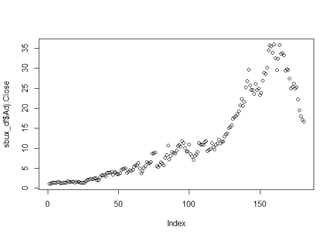
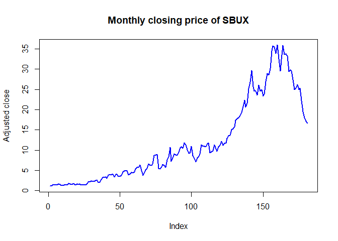
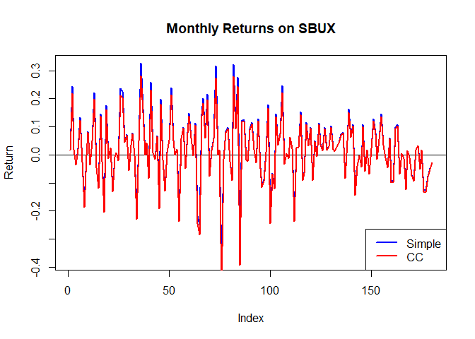
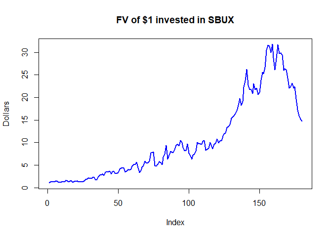

# Lab 1: Return calculations

https://campus.datacamp.com/courses/computational-finance-and-financial-econometrics-with-r/lab-1-return-calculations?ex=1

## Load the monthly Starbucks return data


```r
# Assign the URL to the CSV file
data_url <- 'http://assets.datacamp.com/course/compfin/sbuxPrices.csv'

# Load the data frame using read.csv
sbux_df <-read.csv(data_url, stringsAsFactors=FALSE)
```

## Get a feel for the data


```r
# Check the structure of sbux_df
str(sbux_df)
```

```
## 'data.frame':	181 obs. of  2 variables:
##  $ Date     : chr  "3/31/1993" "4/1/1993" "5/3/1993" "6/1/1993" ...
##  $ Adj.Close: num  1.13 1.15 1.43 1.46 1.41 1.44 1.63 1.59 1.32 1.32 ...
```

```r
# Check the first and last part of sbux_df
head(sbux_df)
```

```
##        Date Adj.Close
## 1 3/31/1993      1.13
## 2  4/1/1993      1.15
## 3  5/3/1993      1.43
## 4  6/1/1993      1.46
## 5  7/1/1993      1.41
## 6  8/2/1993      1.44
```

```r
tail(sbux_df)
```

```
##          Date Adj.Close
## 176 10/1/2007     25.37
## 177 11/1/2007     22.24
## 178 12/3/2007     19.46
## 179  1/2/2008     17.98
## 180  2/1/2008     17.10
## 181  3/3/2008     16.64
```

```r
# Get the class of the Date column of sbux_df
class(sbux_df$Date)
```

```
## [1] "character"
```

## Extract the price data


```r
closing_prices <- sbux_df[, "Adj.Close", drop = FALSE]
head(closing_prices)
```

```
##   Adj.Close
## 1      1.13
## 2      1.15
## 3      1.43
## 4      1.46
## 5      1.41
## 6      1.44
```

##Find indices associated with the dates 3/1/1994 and 3/1/1995


```r
# Find indices associated with the dates 3/1/1994 and 3/1/1995
index_1 <- which(sbux_df$Date == "3/1/1994")
index_2 <- which(sbux_df$Date == "3/1/1995")

# Extract prices between 3/1/1994 and 3/1/1995
some_prices <- sbux_df[index_1:index_2, 'Adj.Close']
```

##Subset directly on dates


```r
# Create a new data frame that contains the price data with the dates as the row names
sbux_prices_df <- sbux_df[, "Adj.Close", drop = FALSE]
rownames(sbux_prices_df) <- sbux_df$Date
head(sbux_prices_df)
```

```
##           Adj.Close
## 3/31/1993      1.13
## 4/1/1993       1.15
## 5/3/1993       1.43
## 6/1/1993       1.46
## 7/1/1993       1.41
## 8/2/1993       1.44
```

```r
# With Dates as rownames, you can subset directly on the dates.
# Find indices associated with the dates 3/1/1994 and 3/1/1995.
price_1 <- sbux_prices_df["3/1/1994", 1]
price_2 <- sbux_prices_df["3/1/1995", 1]
```

##Plot the price data


```r
# Now add all relevant arguments to the plot function below to get a nicer plot
plot(sbux_df$Adj.Close)
```

<!-- -->

```r
plot(sbux_df$Adj.Close, type = "l", col = "blue", lwd = 2, ylab = "Adjusted close",main = "Monthly closing price of SBUX" )
```

<!-- -->

##Calculate simple returns

$$R_{t} = {P_t-{P_{t-1}} \over P_{t-1}}$$


```r
sbux_prices_df <- sbux_df[, "Adj.Close", drop = FALSE]

# Denote n the number of time periods:
n <- nrow(sbux_prices_df)
sbux_ret <- (sbux_prices_df[2:n, 1] - sbux_prices_df[1:(n - 1), 1]) / sbux_prices_df[1:(n - 1), 1]

# Notice that sbux_ret is not a data frame object
class(sbux_ret)
```

```
## [1] "numeric"
```

```r
# Now add dates as names to the vector and print the first elements of sbux_ret to the console to check
# To set the names of a vector, you can use names(vector) <- some_names.
dates<-sbux_df[, "Date", drop = FALSE]
names(sbux_ret)<-dates[2:n, 1]
head(sbux_ret)
```

```
##    4/1/1993    5/3/1993    6/1/1993    7/1/1993    8/2/1993    9/1/1993 
##  0.01769912  0.24347826  0.02097902 -0.03424658  0.02127660  0.13194444
```

##Compute continuously compounded 1-month returns

$$r_t=ln(1+R_t)=ln({P_t \over P_{t-1}})=ln(P_t)-ln(P_{t-1})$$


```r
# The sbux_df data frame is already loaded in your work space
sbux_prices_df <- sbux_df[, "Adj.Close", drop = FALSE]

# Denote n the number of time periods:
n <- nrow(sbux_prices_df)
sbux_ret <- (sbux_prices_df[2:n, 1] - sbux_prices_df[1:(n - 1), 1]) / sbux_prices_df[1:(n - 1), 1]

# Compute continuously compounded 1-month returns
sbux_ccret <-log(sbux_prices_df[2:n, 1]) - log(sbux_prices_df[1:(n - 1), 1])

# Assign names to the continuously compounded 1-month returns
names(sbux_ccret) <- sbux_df[2:n, 1]

# Show sbux_ccret
head(sbux_ccret)
```

```
##    4/1/1993    5/3/1993    6/1/1993    7/1/1993    8/2/1993    9/1/1993 
##  0.01754431  0.21791250  0.02076199 -0.03484673  0.02105341  0.12393690
```

##Compare simple and continuously compounded returns


```r
sbux_prices_df <- sbux_df[, "Adj.Close", drop = FALSE]

# Denote n the number of time periods:
n <- nrow(sbux_prices_df)
sbux_ret <- (sbux_prices_df[2:n, 1] - sbux_prices_df[1:(n - 1), 1]) / sbux_prices_df[1:(n - 1), 1]

# Compute continuously compounded 1-month returns
sbux_ccret <- log(sbux_prices_df[2:n,1]) - log(sbux_prices_df[1:(n - 1),1])
names(sbux_ccret) <- sbux_df[2:n,1]
head(sbux_ccret)
```

```
##    4/1/1993    5/3/1993    6/1/1993    7/1/1993    8/2/1993    9/1/1993 
##  0.01754431  0.21791250  0.02076199 -0.03484673  0.02105341  0.12393690
```

```r
# Compare the simple and cc returns
cat('\n')
```

```r
head(cbind(sbux_ret, sbux_ccret))
```

```
##             sbux_ret  sbux_ccret
## 4/1/1993  0.01769912  0.01754431
## 5/3/1993  0.24347826  0.21791250
## 6/1/1993  0.02097902  0.02076199
## 7/1/1993 -0.03424658 -0.03484673
## 8/2/1993  0.02127660  0.02105341
## 9/1/1993  0.13194444  0.12393690
```

##Graphically compare the simple and continuously compounded returns


```r
# Plot the returns on the same graph
plot(sbux_ret, type = "l", col = "blue", lwd = 2, ylab = "Return", main = "Monthly Returns on SBUX")

# Add horizontal line at zero
abline(h = 0)

# Add a legend
legend(x = "bottomright", legend = c("Simple", "CC"), lty = 1, lwd = 2, col = c("blue", "red"))

# Add the continuously compounded returns
lines(sbux_ccret, type = "l", col = "red", lwd = 2, ylab = "Return")
```

<!-- -->

##Calculate growth of $1 invested in SBUX


```r
# The simple returns (sbux_ret) and the continuously compounded returns (sbux_ccret) have been preloaded in your workspace

# Compute gross returns
# The gross returns is the simple return + 1
sbux_gret <- sbux_ret + 1

# Compute future values
sbux_fv <- cumprod(sbux_gret)

# Plot the evolution of the $1 invested in SBUX as a function of time
plot(sbux_fv, type = "l", col = "blue", lwd = 2, ylab = "Dollars", main = "FV of $1 invested in SBUX")
```

<!-- -->

##Compute one simple Starbucks return

Your workspace contains the vector sbux with the adjusted closing price data for Starbucks stock over the period December 2004 through December 2005. Type sbux in the console to have a look at the data.

Use the data in sbux. What is the simple monthly return between the end of December 2004 and the end of January 2005?


```r
#(sbux[2] - sbux[1]) / sbux[1]
#-13.41%
```

##Compute one continuously compounded Starbucks return

What is the continuously compounded monthly return between December 2004 and January 2005?

Your workspace still contains the vector sbux with the adjusted closing price data for Starbucks stock over the period December 2004 through December 2005.


```r
#n <- length(sbux)
#log(sbux[2:n, 1]) - log(sbux[1:(n - 1), 1])
#-14.39%
```

##Monthly compounding

Assume that all twelve months have the same return as the simple monthly return between the end of December 2004 and the end of January 2005. What would be the annual return with monthly compounding in that case?

Your workspace still contains the vector sbux with the adjusted closing price data for Starbucks stock over the period December 2004 through December 2005.


```r
(1-0.1341)^12-1
```

```
## [1] -0.8223305
```

##Simple annual Starbucks return

Use the data in sbux and compute the actual simple annual return between December 2004 and December 2005.

Your workspace still contains the vector sbux with the adjusted closing price data for Starbucks stock over the period December 2004 through December 2005.


```r
#(sbux[length(sbux)] - sbux[1]) / sbux[1]
#-2.15%
```

##Annual continuously compounded return

Use the data sbux and compute the actual annual continuously compounded return between December 2004 and December 2005.

Your workspace still contains the vector sbux with the adjusted closing price data for Starbucks stock over the period December 2004 through December 2005.


```r
#natural logarithm of one plus annual return
log(1-0.0215)
```

```
## [1] -0.02173449
```
