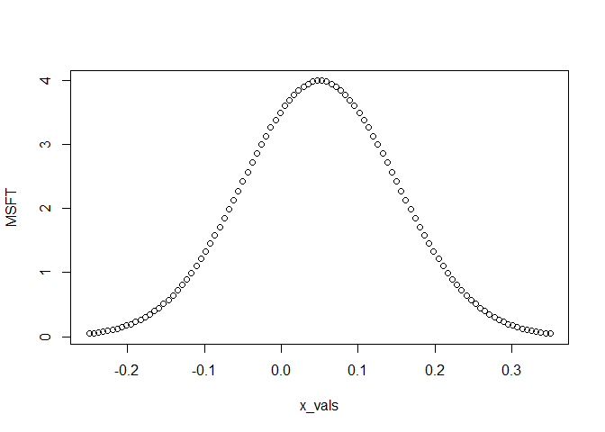
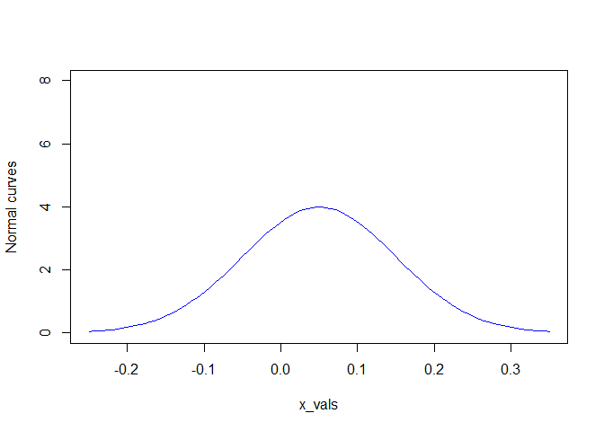
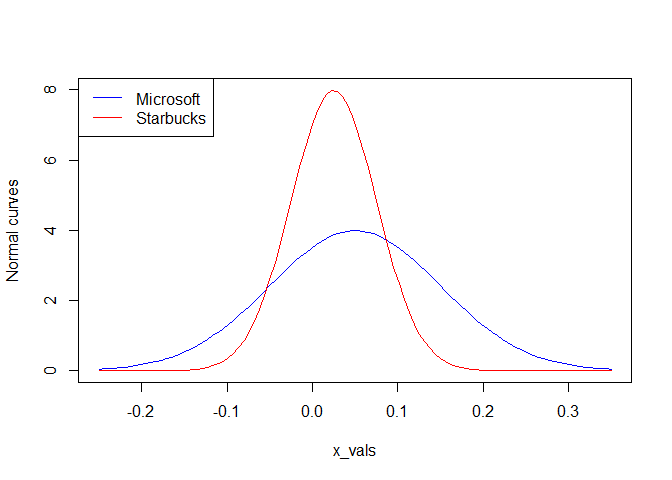

# Lab 2: Random variables and probability distributions

https://campus.datacamp.com/courses/computational-finance-and-financial-econometrics-with-r/lab-2-random-variables-and-probability-distributions?ex=1

## Compute probabilities

In this lab you will become more familiar with random variables and probability distributions.

Suppose $X$ is a normally distributed random variable with a mean $0.05$ and a variance $(0.10)^2$. Start by computing some probabilities.

Probabilities for normally distributed random variables can be computed with the function <code>pnorm()</code>. For instance, if $Z$ is a standard normal random variable, $P_r(Z\leqslant0.5)$ can be computed with <code>pnorm(0.5)</code>. You can supply the mean and the standard deviation of the normal distribution via the arguments <code>mean</code> and <code>sd</code>, respectively.

### Instructions

Assign to <code>mu_x</code> the mean of $X$.
Assign to <code>sigma_x</code> the standard deviation of $X$.
Compute the following probabilities and print the result to the console:

* $Pr(X > 0.10)$
* $Pr(X < -0.10)$
* $Pr(-0.05 < X < 0.15)$


```r
#X ~ N(0.05, (0.10)^2)
mu_x <-0.05
sigma_x <- 0.10

# Pr(X > 0.10)
# 1 - Pr(X < 0.10)
1 - pnorm(0.1, mean=mu_x, sd=sigma_x)
```

```
## [1] 0.3085375
```

```r
# Pr(X < -0.10)
pnorm(-0.1, mean=mu_x, sd=sigma_x)
```

```
## [1] 0.0668072
```

```r
# Pr(-0.05 < X < 0.15)
# Pr(-0.05 < X < 0.15) = Pr(X < 0.15) - Pr(X < -0.05)
pnorm(0.15, mean=mu_x, sd=sigma_x) - pnorm(-0.05, mean=mu_x, sd=sigma_x)
```

```
## [1] 0.6826895
```

## Compute quantiles

Continue with computing quantiles of the normally distributed random variable $X$ with a mean $0.05$ and a variance $(0.10)^2$.

Quantiles of normally distributed random variables can be computed with the function <code>qnorm()</code>. For instance, if $Z$ is a standard normal random variable, the 10% quantile can be computed with <code>qnorm(0.1)</code>. You can supply the mean and the standard deviation of the normal distribution via the arguments <code>mean</code> and <code>sd</code>, respectively.

### Instructions

* Compute the 1%, 5%, 95% and 99% quantile with a single command. Do not assign it to a variable, just print it to the console.


```r
# 1%, 5%, 95% and 99% quantile
qnorm(c(0.01, 0.05, 0.95, 0.99), mean=mu_x, sd=sigma_x)
```

```
## [1] -0.1826348 -0.1144854  0.2144854  0.2826348
```

## Compute densities

Now consider two stocks: Microsoft (ticker: MSFT) and Starbucks (ticker: SBUX). Let $X$ denote the monthly return on the Microsoft stock and let $Y$ denote the monthly return on the Starbucks stock. Assume that $X$ is normally distributed with a mean $0.05$ and a variance $(0.10)^2$, and that $Y$ is normally distributed with a mean $0.025$ and a variance $(0.05)^2$.

Values of a normal density can be computed with function <code>dnorm()</code>. For instance, the value of the standard normal density at 0 can be computed with <code>dnorm(0)</code>. You can supply the mean and the standard deviation of the normal distribution via the arguments <code>mean</code> and <code>sd</code>, respectively.

### Instructions

* For the grid of values in <code>x_vals</code>, compute the values of the assumed normal density for the return on Microsoft stock and assign it to <code>MSFT</code>.
* For the grid of values in <code>x_vals</code>, compute the values of the assumed normal density for the return on Starbucks stock and assign it to <code>SBUX</code>.


```r
# Normally distributed monthly returns
x_vals <- seq(-0.25, 0.35, length.out = 100)
MSFT <- dnorm(x_vals, mean=0.05, sd=0.10)
SBUX <- dnorm(x_vals, mean=0.025, sd=0.05)
```

## Plot normal curve

Continue with the two stocks. The aim is to produce a single plot containing the two assumed normal curves. Start with plotting the normal curve for the return on Microsoft stock.

With <code>plot(x, y)</code>, you can plot the values of <code>y</code> on the y-axis against the values of <code>x</code> on the x-axis. You can customize the plot in many ways through additional arguments (see the documentation): set <code>type = "l"</code> to plot the data as a connected line, use <code>col</code> to specify the line color, set axis labels with <code>xlab</code> and <code>ylab</code>, or set axis limits with <code>xlim</code> and <code>ylim</code>.

### Instructions

Plot a line for the values of the assumed normal density for the return on Microsoft stock (<code>MSFT</code>) against <code>x_vals</code>.
Customize the plot in the following way: use a blue line, set the y-axis label to <code>"Normal curves"</code>, and set the y-axis to be in the interval [0,8].


```r
plot(x_vals, MSFT)
```

<!-- -->

```r
plot(x_vals, MSFT, col = 'blue', type = 'l', ylab = 'Normal curves', ylim = c(0,8))
```

<!-- -->

## Add second normal curve

Now add the normal curve for the return on Starbucks stock to the plot.

You can add lines to a plot with <code>lines(x, y)</code>. Furthermore, you can specify the line color with the <code>col</code> argument.

Note that a plot legend is added for you in the code on the right.

### Instructions

Add a red line for the values of the assumed normal density for the return on Starbucks stock (<code>SBUX</code>) against <code>x_vals</code>.


```r
# Normal curve for MSFT
plot(x_vals, MSFT, type = "l", col = "blue", ylab = "Normal curves", ylim = c(0, 8))

# Add a normal curve for SBUX
lines(x_vals, SBUX, col = "red")

# Add a plot legend
legend("topleft", legend = c("Microsoft", "Starbucks"), 
       col = c("blue", "red"), lty = 1)
```

<!-- -->

## Determine the value-at-risk of simple monthly returns

Consider again the Microsoft stock. Assume that the simple monthly return $R$ is normally distributed with a mean $0.04$ and a variance $(0.09)^2$. The initial wealth to be invested over the month is $100,000.

Determine the 1% and the 5% value-at-risk (VaR) over the month on the investment. That is, determine the loss in investment value that may occur over the next month with a 1% probability and with a 5% probability.

### Instructions

* Assign to <code>mu_R</code> the mean of $R$.
* Assign to <code>sigma_R</code> the standard deviation of $R4.
* Assign to <code>W0</code> the initial wealth.
* Compute the 1% value-at-risk and print the result to the console.
* Compute the 5% value-at-risk and print the result to the console.


```r
# R ~ N(0.04, (0.09)^2) 
mu_R <- 0.04
sigma_R <- 0.09

# Initial wealth W0 equals $100,000
W0 <- 100000

# The 1% value-at-risk
W0 * qnorm(0.01, mean=mu_R, sd=sigma_R)
```

```
## [1] -16937.13
```

```r
# The 5% value-at-risk
W0 * qnorm(0.05, mean=mu_R, sd=sigma_R)
```

```
## [1] -10803.68
```

## Determine the value-at-risk of continuously compounded monthly returns

Instead of the simple monthly return, now look at the continuously compounded monthly return rr of the Microsoft stock. Assume that rr is normally distributed with a mean $0.04$ and a variance $(0.09)^2$. The initial wealth to be invested over the month is $100,000.

Determine the 1% and the 5% value-at-risk (VaR) over the month on the investment. That is, determine the loss in investment value that may occur over the next month with a 1% probability and with a 5% probability.

Use the fact that the continuously compounded return quantile can be transformed to a simple return quantile with the transformation $R=e^r-1$. The exponential $e^r$ can easily be computed with <code>exp(r)</code>.

### Instructions

* Assign to <code>mu_r</code> the mean of $r$.
* Assign to <code>sigma_r</code> the standard deviation of $r$.
* Assign to <code>W0</code> the initial wealth.
* Compute the 1% value-at-risk and print the result to the console.
* Compute the 5% value-at-risk and print the result to the console.


```r
# r ~ N(0.04, (0.09)^2) 
mu_r <- 0.04
sigma_r <- 0.09

# Initial wealth W0 equals $100,000
W0 <- 100000

# The 1% value-at-risk
W0 * (exp(qnorm(0.01, mean = mu_r, sd = sigma_r)) - 1)
```

```
## [1] -15580.46
```

```r
# The 5% value-at-risk
W0 * (exp(qnorm(0.05, mean = mu_r, sd = sigma_r)) - 1)
```

```
## [1] -10240.55
```

## Compute simple monthly returns

For the remaining exercises, consider a one-month investment in two Northwest stocks: Amazon and Costco.

Suppose you buy Amazon and Costco at the end of September at $P_{A,t-1}=38.23$, $P_{C,t-1}=41.11$ and then sell at the end of October for $P_{A,t}=41.29$, $P_{C,t}=41.74$. Compute the simple monthly returns for the two stocks.

Note that the above prices were the actual closing prices for 2004 taken from Yahoo!.

### Instructions

* Assign to <code>PA</code> a vector that contains the prices of the Amazon stock.
* Assign to <code>PC</code> a vector that contains the prices of the Costco stock.
* Compute the simple monthly return on the Amazon stock and assign it to <code>RA</code>.
* Compute the simple monthly return on the Costco stock and assign it to <code>RC</code>.


```r
# Vectors of prices
PA <- c(38.23, 41.29)
PC <- c(41.11, 41.74)

# Simple monthly returns
RA <- (41.29- 38.23)/38.23
RA
```

```
## [1] 0.08004185
```

```r
RC <- (41.74- 41.11)/41.11
RC
```

```
## [1] 0.01532474
```

## Compute continuously compounded monthly returns

Now compute the continuously compounded monthly returns on the Amazon and Costco stocks.

### Instructions

* Compute the continuously compounded monthly return for Amazon and assign it to <code>rA</code>.
* Compute the continuously compounded monthly return for Costco and assign it to <code>rC</code>.


```r
# The simple returns on Amazon (RA) and Costco (RC) are still in your workspace

# Continuously compounded returns
rA <- log(41.29) - log(38.23)
rA
```

```
## [1] 0.07699979
```

```r
rC <- log(41.74) - log(41.11)
rC
```

```
## [1] 0.0152085
```

## Compute simple total returns and dividend yields

Suppose Amazon paid a $0.10 per share cash dividend at the end of October. Compute the monthly simple total return on Amazon and the monthly dividend yield.

### Instructions

* Assign to <code>DA</code> the cash dividend per share.
* Compute the monthly simple total return and assign it to <code>RA_total</code>.
* Compute the monthly dividend yield and assign it to <code>DY</code>.


```r
# The prices for Amazon (PA) are still in your workspace

# Cash dividend per share
DA <- 0.10

# Simple total return
RA_total <- (PA[2] + DA)/PA[1] - 1
RA_total
```

```
## [1] 0.0826576
```

```r
# Dividend yield
DY <- DA / PA[1]
DY
```

```
## [1] 0.002615747
```

## Compute annual returns

Suppose the monthly returns on Amazon are equal to RA every month for one year. Compute the simple annual returns, as well as the continuously compounded annual returns.

### Instructions

* Compute the simple annual return and assign it to <code>RA_annual</code>.
* Compute the continuously compounded annual return and assign it to <code>rA_annual</code>.


```r
# The simple monthly return on Amazon (RA) is still in your workspace

# Simple annual return
RA_annual <- (RA + 1) ^ 12 - 1
RA_annual
```

```
## [1] 1.519341
```

```r
# Continuously compounded annual return
rA_annual <- log(1 + RA_annual)
rA_annual
```

```
## [1] 0.9239975
```

## Compute portfolio shares and portfolio returns

At the end of September 2004, suppose you have $10,000 to invest in Amazon and Costco over the next month.

Compute your portfolio shares if you invest $8,000 in Amazon and $2,000 in Costco. Moreover, compute the simple monthly return on the portfolio and assume that no dividends were paid.

### Instructions

* Compute the portfolio share of your Amazon stocks and assign it to <code>xA</code>.
* Compute the portfolio share of your Costco stocks and assign it to <code>xC</code>.
* Compute the simple monthly return on the portfolio and print the result to the console.


```r
# The simple returns on Amazon (RA) and Costco (RC) are still in your workspace

# Portfolio shares
xA <- 8000 / 10000
xC <- 2000 / 10000

# Simple monthly return
xA * RA + xC * RC
```

```
## [1] 0.06709843
```


