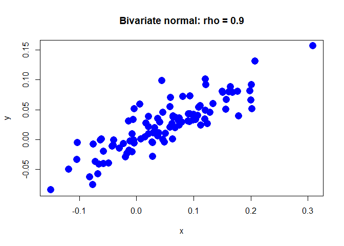
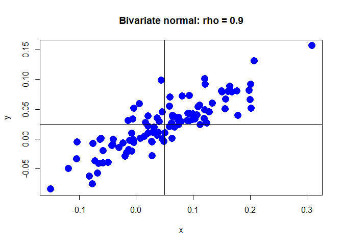
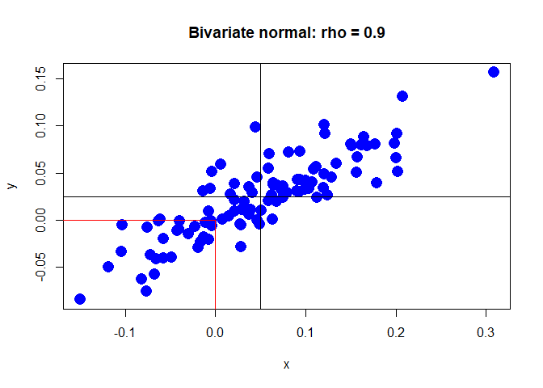
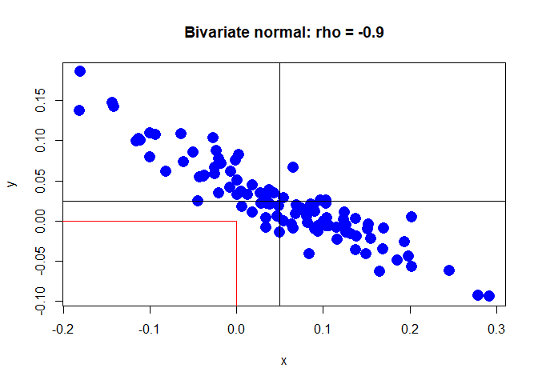
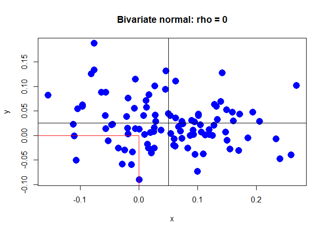

# Lab 3: Bivariate distributions

https://campus.datacamp.com/courses/computational-finance-and-financial-econometrics-with-r/lab-3-bivariate-distributions?ex=1

## Covariance matrix

In this lab you will learn to draw observations from bivariate normal distributions, and explore the resulting data to familiarize yourself with relationships between two random variables.

Let us assume that $X$ and $Y$ are bivariate normally distributed. Get started by defining a covariance matrix. Suppose that the standard deviations are $\sigma_X=0.10$ and $\sigma_Y=0.05$, and that the correlation is $\rho_{XY}=0.9$.

Matrices can be created with the <code>matrix()</code> function. You should supply the values as the first argument and specify the dimensions with the nrow and ncol arguments. For example, <code>matrix(c(-0.5, 0.5), nrow = 1, ncol = 2)</code> creates a matrix with one row and two columns. By default, the matrix is filled column by column, but you can fill the matrix row by row by setting <code>byrow = TRUE</code>.

### Instructions

* Compute the covariance between $X$ and $Y$ and assign it to <code>sig_xy</code>.
* Construct the covariance matrix and assign it to <code>Sigma_xy</code>.


```r
# Standard deviations and correlation
sig_x <- 0.10
sig_y <- 0.05
rho_xy <- 0.9

# Covariance between X and Y
sig_xy <- rho_xy * sig_x * sig_y

# Covariance matrix
Sigma_xy <-  matrix(c(sig_x ^ 2, sig_xy, sig_xy, sig_y ^ 2), 2, 2)
```

## Simulate data

Let us continue by simulating observations from the bivariate normally distributed random variables $X$ and $Y$.

Notice that the second line in the R script on the right loads the <code>mvtnorm</code> R package. <code>mvtnorm</code> is an R library, containing extra functionality (see mvtnorm documentation), which makes it easy to simulate data from a bivariate (or more generally, a multivariate) normal distribution. We will be using the <code>rmvnorm()</code> function from the package. If you would like to use the <code>mvtnorm</code> package at home, use the <code>install.packages</code> function to first install the package on your own computer.

You can supply the mean vector and the covariance matrix via the arguments <code>mean</code> and <code>sigma</code>, of the <code>rmvnorm()</code> function respectively. For instance, you can draw 10 observations from a bivariate standard normal distribution with <code>rmvnorm(10, mean = c(0, 0), sigma = diag(2))</code>.

When you simulate data, it is often useful to have reproducible results. This can be achieved by setting the seed of the random number generator beforehand with the <code>set.seed()</code> function. For more information, see the documentation on random number generation.

### Instructions

* Simulate 100 observations from the bivariate normal distributed random variables XX and YY. Use the covariance matrix <code>Sigma_xy</code> from the previous exercise and suppose that the means are $\mu_X=0.05$ and $\mu_Y=0.025$. Assign the result to <code>xy_vals</code>.
* Have a look at the first few observations with the <code>head()</code> function.


```r
# Load the mvtnorm package
library("mvtnorm")

# The covariance matrix (Sigma_xy) is still in your workspace

# Means
mu_x <- 0.05
mu_y <- 0.025

# Simulate 100 observations
set.seed(123)  # for reproducibility
xy_vals <- rmvnorm(100, c(mu_x, mu_y), Sigma_xy)
  
# Have a look at the first observations
head(xy_vals)
```

```
##             [,1]         [,2]
## [1,] -0.01055124 -0.002720223
## [2,]  0.19865393  0.081562113
## [3,]  0.12156743  0.091291081
## [4,]  0.04939103 -0.004618093
## [5,] -0.02987387 -0.014866126
## [6,]  0.17729184  0.080391233
```

## Plot the simulated data

Now create a scatterplot of the simulated observations to explore the direction and strength of the linear association.

With <code>plot(x, y)</code>, you can create a scatterplot with the values of <code>x</code> on the x-axis and the values of <code>y</code> on the y-axis. You can customize the plot in many ways through additional arguments (see the documentation): pch to specify a plot symbol, <code>cex</code> to set the symbol size, <code>col</code> to set the color, <code>main</code> to add a title, or <code>xlab</code> and <code>ylab</code> to set axis labels.

### Instructions

* Create a scatterplot of the simulated observations
* Customize the plot in the following way: specify the plot symbol with <code>pch = 16</code>, set the symbol size to <code>2</code>, set the color to <code>"blue"</code>, use the title <code>"Bivariate normal: rho = 0.9"</code>, and use the axis labels <code>"x"</code> and <code>"y"</code>.


```r
# The simulated values (xy_vals) are still in your workspace
plot(xy_vals[, 1], xy_vals[, 2], pch = 16, cex = 2, col = 'blue',
     main = 'Bivariate normal: rho = 0.9', xlab = 'x', ylab = 'y')
```

<!-- -->

```r
# Create scatterplot
```

## Add lines to the plot

Continue with the scatterplot. To indicate the central location of the point cloud, add a vertical line that indicates the mean of $X$ and a horizontal line that indicates the mean of $Y$.

Straight lines can be added to a plot with the <code>abline()</code> function. You can use the argument <code>h</code> to specify the y-values of horizontal lines, and the argument <code>v</code> to specify the x-values of vertical lines. For example, <code>abline(h = 0)</code> adds a horizontal line at 0.


```r
# Simulated values (xy_vals) and means (mu_x, mu_y) are still in your workspace

# create scatterplot
plot(xy_vals[, 1], xy_vals[, 2], pch = 16, cex = 2, col = "blue", 
     main = "Bivariate normal: rho = 0.9", xlab = "x", ylab = "y")

# Add lines
abline(h = mu_y, v = mu_x)
```

<!-- -->

## Compute a joint probability

The red line segments in the scatterplot on the right indicate the area where $X\leq0$ and $Y\leq0$. Your task is to compute the joint probability $P_r(X\leq0,Y\leq0)$.

Probabilities for a bivariate (or more generally, a multivariate) normal distribution can be computed with the function <code>pmvnorm</code> from package <code>mvtnorm</code> (see its documentation).
You should supply the lower limits as the <code>lower</code> argument and the <code>upper</code> limits as the upper argument. Note that you can use <code>-Inf</code> for $-\infty$ and <code>Inf</code> for $\infty$. In addition, you can set the mean vector and the covariance matrix via the arguments <code>mean</code> and <code>sigma</code>, respectively.

Note that you can use <code>args(pmvnorm)</code> to display the arguments of the <code>pmvnorm()</code> function. Try this out in the console.

### Instructions

* Compute the joint probability $P_r(X\leq0,Y\leq0)$.


```r
# Means (mu_x, mu_y) and covariance matrix (Sigma_xy) are still in your workspace

# create scatterplot
plot(xy_vals[, 1], xy_vals[, 2], pch = 16, cex = 2, col = "blue", 
     main = "Bivariate normal: rho = 0.9", xlab = "x", ylab = "y")

# Add lines
abline(h = mu_y, v = mu_x)

# Add line segments
segments(x0 = 0, y0 = -1e10, x1 = 0, y1 = 0, col = "red")
segments(x0 = -1e10, y0 = 0, x1 = 0, y1 = 0, col = "red")
```

<!-- -->

```r
# Compute joint probability
pmvnorm(c(-Inf, -Inf), c(0, 0), c(mu_x, mu_y), sigma = Sigma_xy)
```

```
## [1] 0.2453259
## attr(,"error")
## [1] 1e-15
## attr(,"msg")
## [1] "Normal Completion"
```

## Negatively correlated random variables

Now that you have explored positively correlated data, reconsider the bivariate normally distributed random variables $X$ and $Y$. Suppose that they are <i>negatively correlated</i> with correlation $\rho_{XY}=-0.9$.

The code on the right contains all the solutions to the previous exercises.

### Instructions

Change the code to perform the same analysis with negative correlation $\rho_{XY}=-0.9$ instead of $\rho_{XY}=0.9$.


```r
# Standard deviations and correlation
sig_x <- 0.10
sig_y <- 0.05
rho_xy <- -0.9
sig_xy <- rho_xy * sig_x * sig_y
Sigma_xy <- matrix(c(sig_x ^ 2, sig_xy, sig_xy, sig_y ^ 2), nrow = 2, ncol = 2)
mu_x <- 0.05
mu_y <- 0.025

# Simulate 100 observations
set.seed(123)
xy_vals <- rmvnorm(100, mean = c(mu_x, mu_y), sigma = Sigma_xy)
head(xy_vals)
```

```
##             [,1]         [,2]
## [1,] 0.005403536  0.036129207
## [2,] 0.193766631 -0.026479922
## [3,] 0.002687517  0.082329487
## [4,] 0.137078885 -0.036566550
## [5,] 0.001017241  0.032743153
## [6,] 0.152351306 -0.004456129
```

```r
# Create plot
plot(xy_vals[, 1], xy_vals[, 2], pch = 16, cex = 2, col = "blue", 
     main = "Bivariate normal: rho = -0.9", xlab = "x", ylab = "y")
abline(h = mu_y, v = mu_x)
segments(x0 = 0, y0 = -1e10, x1 = 0, y1 = 0, col = "red")
segments(x0 = -1e10, y0 = 0, x1 = 0, y1 = 0, col = "red")
```

<!-- -->

```r
# Compute joint probability
pmvnorm(lower = c(-Inf, -Inf), upper = c(0, 0), 
        mean = c(mu_x, mu_y), sigma = Sigma_xy)
```

```
## [1] 0.0008028802
## attr(,"error")
## [1] 1e-15
## attr(,"msg")
## [1] "Normal Completion"
```

## Uncorrelated random variables

For the last exercise, take a look at what happens when you have uncorrelated random variables. In other words, suppose that the random variables $X$ and $Y$ are bivariate normally distributed with correlation $\rho_{XY}=0$.

On the right, you find the code that contains the solution to the previous exercise.

### Instructions

Change the code to perform the same analysis with correlation $\rho_{XY}=0$ instead of $\rho_{XY}=-0.9$.


```r
# Standard deviations and correlation
sig_x <- 0.10
sig_y <- 0.05
rho_xy <- 0
sig_xy <- rho_xy * sig_x * sig_y
Sigma_xy <- matrix(c(sig_x ^ 2, sig_xy, sig_xy, sig_y ^ 2), nrow = 2, ncol = 2)
mu_x <- 0.05
mu_y <- 0.025

# Simulate 100 observations
set.seed(123)
xy_vals <- rmvnorm(100, mean = c(mu_x, mu_y), sigma = Sigma_xy)
head(xy_vals)
```

```
##              [,1]         [,2]
## [1,] -0.006047565  0.013491126
## [2,]  0.205870831  0.028525420
## [3,]  0.062928774  0.110753249
## [4,]  0.096091621 -0.038253062
## [5,] -0.018685285  0.002716901
## [6,]  0.172408180  0.042990691
```

```r
# Create plot
plot(xy_vals[, 1], xy_vals[, 2], pch = 16, cex = 2, col = "blue", 
     main = "Bivariate normal: rho = 0", xlab = "x", ylab = "y")
abline(h = mu_y, v = mu_x)
segments(x0 = 0, y0 = -1e10, x1 = 0, y1 = 0, col = "red")
segments(x0 = -1e10, y0 = 0, x1 = 0, y1 = 0, col = "red")
```

<!-- -->

```r
# Compute joint probability
pmvnorm(lower = c(-Inf, -Inf), upper = c(0, 0), 
        mean = c(mu_x, mu_y), sigma = Sigma_xy)
```

```
## [1] 0.09519541
## attr(,"error")
## [1] 1e-15
## attr(,"msg")
## [1] "Normal Completion"
```

## Correlation

Consider the two random variables $X$ and $Y$ with $\mu_X=0.05$ and $\mu_Y=0.025$, $\sigma_X=0.10$, $\sigma_Y=0.05$. The correlation between $X$ and $Y$ is $\rho_{XY}$.

Given the graph on the right, what is $\rho_{XY}$?


```r
0
```

```
## [1] 0
```

## Correlation (2)

Consider the two random variables $X$ and $Y$ with $\mu_X=0.05$ and $\mu_Y=0.025$, $\sigma_X=0.10$, $\sigma_Y=0.05$. The correlation between $X$ and $Y$ is $\rho_{XY}$.

Given the graph on the right, what is $\rho_{XY}$?


```r
-0.9
```

```
## [1] -0.9
```

## Calculate the probability

Consider two random variables $X$ and $Y$ with $\mu_X=0.05$ and $\mu_Y=0.025$, $\sigma_X=0.10$, $\sigma_Y=0.05$. The correlation between $X$ and $Y$ is $\rho$.

If $\rho=0.9$ what is $P_r(X\leq0,Y\leq0)$?


```r
sig_x <- 0.10
sig_y <- 0.05
rho <- 0.9
sig_xy <- rho * sig_x * sig_y
Sigma_xy <- matrix(c(sig_x ^ 2, sig_xy, sig_xy, sig_y ^ 2), nrow = 2, ncol = 2)
mu_x <- 0.05
mu_y <- 0.025
pmvnorm(lower = c(-Inf, -Inf), upper = c(0, 0), mean = c(mu_x, mu_y), sigma = Sigma_xy)
```

```
## [1] 0.2453259
## attr(,"error")
## [1] 1e-15
## attr(,"msg")
## [1] "Normal Completion"
```

## Calculate the probability (2)

Consider the same two random variables $X$ and $Y$ with $\mu_X=0.05$ and $\mu_Y=0.025$, $\sigma_X=0.10$, $\sigma_Y=0.05$. The correlation between $X$ and $Y$ is $\rho$.

If $\rho=0$ what is $P_r(X\leq0,Y\leq0)$?


```r
sig_x <- 0.10
sig_y <- 0.05
rho <- 0
sig_xy <- rho * sig_x * sig_y
Sigma_xy <- matrix(c(sig_x ^ 2, sig_xy, sig_xy, sig_y ^ 2), nrow = 2, ncol = 2)
mu_x <- 0.05
mu_y <- 0.025
pmvnorm(lower = c(-Inf, -Inf), upper = c(0, 0), mean = c(mu_x, mu_y), sigma = Sigma_xy)
```

```
## [1] 0.09519541
## attr(,"error")
## [1] 1e-15
## attr(,"msg")
## [1] "Normal Completion"
```

## Calculate the probability (3)

Consider the same two random variables $X$ and $Y$ with $\mu_X=0.05$ and $\mu_Y=0.025$, $\sigma_X=0.10$, $\sigma_Y=0.05$. The correlation between $X$ and $Y$ is $\rho$.

If $\rho=-0.9$ what is $P_r(X\leq0,Y\leq0)$?


```r
sig_x <- 0.10
sig_y <- 0.05
rho <- -0.9
sig_xy <- rho * sig_x * sig_y
Sigma_xy <- matrix(c(sig_x ^ 2, sig_xy, sig_xy, sig_y ^ 2), nrow = 2, ncol = 2)
mu_x <- 0.05
mu_y <- 0.025
pmvnorm(lower = c(-Inf, -Inf), upper = c(0, 0), mean = c(mu_x, mu_y), sigma = Sigma_xy)
```

```
## [1] 0.0008028802
## attr(,"error")
## [1] 1e-15
## attr(,"msg")
## [1] "Normal Completion"
```


