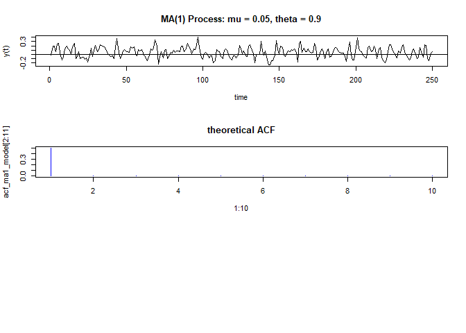

# Lab 4: Simulating time series data

https://campus.datacamp.com/courses/computational-finance-and-financial-econometrics-with-r/lab-4-simulating-time-series-data?ex=1

## Simulate data from a MA(1) model

Consider the MA(1) model
$$Y_t=0.05+\epsilon_t+\theta\epsilon_{t-1},$$
with $|\theta|<0$ and $\epsilon_t iid N(0,(0.1)^2)$.

In this exercise, you will simulate 250 observations from the above model. You can use the <code>arima.sim()</code> function in R to simulate a moving average or autoregressive process (see documentation). Furthermore, you should specify the following arguments for <code>arima.sim</code>:

The <code>model</code> argument should contain a list that indicates the type of model that you would like to simulate from. For a MA(1) model with $\theta=0.3$, for example, you should set the <code>model</code> argument to <code>list(ma = 0.3)</code>.

<code>n</code> specifies the number of observations to simulate.

If you take a close look at the documentation of arima, you will notice that there is no constant included in the model. This means that you will need to add the constant <code>0.05</code> yourself.

### Instructions

Simulate 250 observations from the above MA(1) model with $\theta=0.5$ and the constant $0.05$. Assign the result to <code>ma1_sim</code>.


```r
set.seed(123)
# Simulate 250 observations from the described MA(1) model
ma1_sim <- 0.05 + arima.sim(n = 250, model = list(ma = 0.5), mean = 0, sd = 0.1)
```

## Plot the data from the simulated MA(1) model

Still consider the MA(1) model
$$Y_t=0.05+\epsilon_t+\theta\epsilon_{t-1}$$,
with $|\theta|<0$ and $\epsilon_t iid N(0,(0.1)^2)$.

The code on the right simulates 250 observations and should look familiar.

### Instructions

* Make a line plot of the observations in <code>ma1_sim</code> with the title "MA(1) Process: mu = 0.05, theta = 0.5". Label the x-axis with "time" and the y-axis with "y(t)". A line plot can be specified by setting <code>type = "l"</code> of the <code>plot()</code> function.
* Add a horizontal line at zero.


```r
set.seed(123)

# Simulate 250 observations from the described MA(1) model
ma1_sim <- arima.sim(model = list(ma = 0.5), n = 250, mean = 0, sd = 0.1) + 0.05

# A line plot of the simulated observations
```


```r
plot(ma1_sim, type = 'l', main = 'MA(1) Process: mu = 0.05, theta = 0.5', xlab = 'time', ylab = 'y(t)')
abline(h = 0)
```

<!-- -->

## Plotting the theoretical and the sample ACF

Still consider the MA(1) model
$$Y_t=0.05+\epsilon_t+\theta\epsilon_{t-1}$$,
with $|\theta|<0$ and $\epsilon_t iid N(0,(0.1)^2)$.

While we still assume $\theta=0.5$, the theoretical value for the first order autocorrelation is $\rho_1=\frac{\theta}{1+\theta^2}=\frac{0.5}{1+0.5^2}=0.4$. The theoretical autocorrelation function gives you for each lag the autocorrelation implied by the model. In R, you can use the <code>ARMAacf</code> function to calculate the theoretical autocorrelations for an ARMA model. The ma argument should contain the moving average coefficients, and <code>lag.max</code> specifies the maximum number of lags for which the autocorrelations should be calculated.

Based on the simulated data, you can also easily calculate the sample autocorrelation function in R with the <code>acf()</code> function. It automatically generates a plot of the sample autocorrelation function. Check the documentation of <code>acf</code> for more info.

### Instructions

* Use the <code>ARMAacf</code> function to calculate the theoretical autocorrelations up to lag 10. Assign the result to <code>acf_ma1_model</code>.

* Construct the plot of the sample autocorrelations up to lag 10 by using the <code>acf()</code> function. Set the title of the plot to "Sample ACF".


```r
set.seed(123)

# Simulate 250 observations from the described MA(1) model
ma1_sim <- arima.sim(model = list(ma = 0.5), n = 250, mean = 0, sd = 0.1) + 0.05

# Generate the theoretical ACF with upto lag 10
acf_ma1_model <- ARMAacf(ma = 0.5, lag.max = 10)

# Split plotting window in three rows
par(mfrow = c(3, 1))

# First plot: The simulated observations
plot(ma1_sim, type = "l", main = "MA(1) Process: mu = 0.05, theta = 0.5", xlab = "time", ylab = "y(t)")
abline(h = 0)

# Second plot: Theoretical ACF
plot(1:10, acf_ma1_model[2:11], type = "h", col = "blue",  ylab = "ACF", main = "theoretical ACF")

# Third plot: Sample ACF
# Assign to tmp the Sample ACF
tmp <- acf(ma1_sim, lag.max = 10, main = 'Sample ACF')
```

<!-- -->

```r
# Reset graphical window to only one graph
par(mfrow = c(1, 1))
```

## A different MA(1) model

Still consider the MA(1) model
$$Y_t=0.05+\epsilon_t+\theta\epsilon_{t-1}$$
with $|\theta|<0$ and $\epsilon_t iid N(0,(0.1)^2)$.

### Instructions

Now assume that $\epsilon=0.9$ instead of $\epsilon=0.5$. Rewrite the code on the right such that it simulates data from the correct model and displays the three graphs correctly.


```r
set.seed(123)

# Simulate 250 observations from the described MA(1) model
ma1_sim <- arima.sim(model = list(ma = 0.9), n = 250, mean = 0, sd = 0.1) + 0.05

# Generate the theoretical ACF with upto lag 10
acf_ma1_model <- ARMAacf(ma = 0.9, lag.max = 10)

# Split plotting window in three rows
par(mfrow = c(3, 1))

# First plot: The simulated observations
plot(ma1_sim, type = "l", main = "MA(1) Process: mu = 0.05, theta = 0.9", xlab = "time", ylab = "y(t)")
abline(h = 0)

# Second plot: Theoretical ACF
plot(1:10, acf_ma1_model[2:11], type = "h", col = "blue", main = "theoretical ACF")
```

<!-- -->

## An AR(1) model

Now consider the AR(1) model
$$Y_t-0.05=\phi(Y_{t-1}-0.05)$$
with $|\phi|<0$ and $\epsilon_t iid N(0,(0.1)^2)$.

Assume that $\phi=0.5$ and rewrite the code in such a way that it simulates data from the AR(1) model and that it displays the three corresponding graphs from the previous exercise correctly.

### Instructions

Assign to <code>ar1_sim</code> 250 observations simulated from the described AR(1) model.
Assign to <code>acf_ar1_model</code> the theoretical autocorrelations up to lag 10.
Create the three plot functions from the previous exercise but now for the AR(1) model instead of the MA(1) model. Have a look at the code of the previous exercise if you are unsure.


```r
set.seed(123)

# Simulate 250 observations from the described AR(1) model
ar1_sim <- arima.sim(list(ar = 0.5), 250, mean = 0, sd = 0.1) + 0.05

# Generate the theoretical ACF with ten lags
acf_ar1_model <- ARMAacf(ar = 0.5, lag.max = 10)

# Split plotting window in three rows
par(mfrow = c(3, 1))

# First plot: The simulated observations
plot(ar1_sim, type = "l", main = "AR(1) Process: mu = 0.05, phi = 0.5", xlab = "time", ylab = "y(t)")
abline(h = 0)

# Second plot: Theoretical AFC
plot(1:10, acf_ar1_model[2:11], type = "h", col = "blue", main = "theoretical ACF")

# Third plot: Sample AFC
tmp <- acf(ar1_sim, lag.max = 10, main = 'Sample ACF')
```

<!-- -->

```r
# Reset plotting window to default
par(mfrow = c(1, 1))
```

## Visually inspect the time series

Which model is most likely to have generated the data in the chart on the right?

### Possible Answers

* AR(1) with phi = 0.9
* MA(1) with theta = 0.9


```r
phi = 0.9
```

## Visually inspect the time series (2)

Which model is most likely to have generated the data in the chart on the right?

### Possible Answers

* AR(1) with phi = 0.9
* MA(1) with theta = 0.9


```r
theta = 0.9
```
