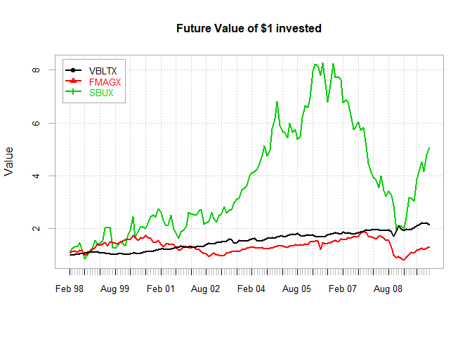

# Lab 5: Analyzing stock returns

https://campus.datacamp.com/courses/computational-finance-and-financial-econometrics-with-r/lab-5-analyzing-stock-returns?ex=1

## Getting the financial data

In this lab, you will learn more about the analysis of stock returns by using the R packages <code>PerformanceAnalytics</code>, <code>zoo</code> and <code>tseries</code> (click them for more information).

In this first exercise, you will use the <code>get.hist.quote</code> function from the <code>tseries</code> package. The function allows you to download historical financial data over the web. The code on the right downloads the adjusted closing prices from the start of 1998 up to the end of 2009 from Yahoo! for the stocks with tickers <code>VBLTX</code> and <code>FMAGX</code>. The code further specifies that the data should be of the <code>zoo</code> class which is indexed by time. Since we deal with monthly data, it is a good idea to change the class of the time series index with the <code>as.yearmon()</code> function.

### Instructions

* Assign to <code>SBUX_prices</code> the prices of the Starbucks stock in the same way as <code>VBLTX</code> and <code>FMAGX</code>.
* Change the class of the index of <code>SBUX_prices</code> with the <code>as.yearmon()</code> function. Both <code>index()</code> and <code>yearmon()</code> are functions in the <code>zoo</code> package.
* Print the start and the end of the time series to the console by applying the <code>start()</code> and <code>end()</code> functions to <code>SBUX_prices</code>.


```r
# Load relevant packages
library(PerformanceAnalytics)
library(zoo)
library(tseries)

# Get the adjusted closing prices from Yahoo!
VBLTX_prices <- get.hist.quote(instrument = "vbltx", start = "1998-01-01", end = "2009-12-31", quote = "AdjClose", provider = "yahoo", origin = "1970-01-01", compression = "m", retclass = "zoo", quiet = TRUE)

# Get the adjusted closing prices from Fidelity Magellan
FMAGX_prices <- get.hist.quote(instrument = "fmagx", start = "1998-01-01", end = "2009-12-31", quote = "AdjClose", provider = "yahoo", origin = "1970-01-01", compression = "m", retclass = "zoo", quiet = TRUE)

# Get the adjusted closing prices from Starbucks
SBUX_prices <- get.hist.quote(instrument = "sbux", start = "1998-01-01", end = "2009-12-31", quote = "AdjClose", provider = "yahoo", origin = "1970-01-01", compression = "m", retclass = "zoo", quiet = TRUE)

# Change the class of the time index to yearmon
index(VBLTX_prices) <- as.yearmon(index(VBLTX_prices))
index(FMAGX_prices) <- as.yearmon(index(FMAGX_prices))
index(SBUX_prices) <- as.yearmon(index(SBUX_prices))

# Inspect SBUX_prices
head(SBUX_prices)
```

```
##          Adjusted
## Jan 1998 2.035331
## Feb 1998 2.202333
## Mar 1998 2.522414
## Apr 1998 2.678977
## May 1998 2.672021
## Jun 1998 2.974707
```

## Calculating the returns

In this lab, you will learn more about the analysis of stock returns by using the R packages <code>PerformanceAnalytics</code>, <code>zoo</code> and <code>tseries</code> (click them for more information).

We obtained the price series for multiple stocks from 1998 to 2009. These price series are already loaded into your environment as <code>VBLTX_prices</code>, <code>FMAGX_prices</code> and <code>SBUX_prices</code>. It is often convenient to store these time series in a single variable before we start the analysis. You will use the <code>merge()</code> function to do that, since it merges series by column while taking into account the time index.

Remember that the continuously compounded returns are defined as the difference between the log prices. Once all price series are merged by column, you can easily calculate the continuously compounded returns. Use the <code>log()</code> function to calculate the log prices and apply the <code>diff()</code> function to the object that contains the log prices to get the continuously compounded returns.

### Instructions

* Assign to all_prices the merged price series <code>VBLTX_prices</code>, <code>FMAGX_prices</code>, <code>SBUX_prices</code> such that each column contains the prices of one stock.
Calculate the continuously compounded returns with the help of the <code>diff()</code> and <code>log()</code> functions.
Have a look at the data in the console.


```r
# The variables VBLTX_prices, FMAGX_prices and SBUX_prices are preloaded in your workspace

# Create merged price data
all_prices <- merge(VBLTX_prices, FMAGX_prices, SBUX_prices)

  # Rename columns
colnames(all_prices) <- c("VBLTX", "FMAGX", "SBUX")

# Calculate cc returns as difference in log prices
all_returns <- diff(log(all_prices))

# Look at the return data
start(all_returns)
```

```
## [1] "Feb 1998"
```

```r
end(all_returns)
```

```
## [1] "Dec 2009"
```

```r
colnames(all_returns) 
```

```
## [1] "VBLTX" "FMAGX" "SBUX"
```

```r
head(all_returns)
```

```
##                 VBLTX        FMAGX        SBUX
## Feb 1998 -0.004880482  0.073068780  0.07885879
## Mar 1998  0.001036754  0.049066373  0.13569913
## Apr 1998  0.006181642  0.011512694  0.06021863
## May 1998  0.018137241 -0.045728242 -0.00259989
## Jun 1998  0.020747580  0.067677008  0.10731043
## Jul 1998 -0.005911121 -0.007507786 -0.24382159
```

## Plotting financial data with PerformanceAnalytics

The <code>PerformanceAnalytics</code> package implements a collection of econometric functions for performance and risk analysis. It contains - among other things - functionality to generate great plots of financial time series. You will use some of that functionality in this exercise. Find an overview of the plotting functionality in the package here.

The <code>chart.TimeSeries</code> function generates a line plot of (multiple) return series, which allows you to assess the volatility of different assets, for example. While this is nice, charts generated by <code>chart.TimeSeries</code> could be hard to read when you evaluate the returns. The <code>PerformanceAnalytics()</code> function <code>chart.Bar</code> makes it easier to compare the returns of different assets on the same plot. Click 'Submit Answer' and use the arrows to compare the two plots. With all assets on the same scale, you see the lower volatility for the bond fund and the higher volatility for SBUX very clearly.

Lastly, have a look at the <code>chart.CumReturns</code> function which creates a cumulative return plot. It allows you to assess how a $1 investment in each asset evolved over time.

### Instructions

* Generate a cumulative return plot with the <code>chart.CumReturns</code> function. Make sure that you understand how the simple returns are calculated and use them as input of the function. Furthermore, set the <code>wealth.index</code> argument to <code>TRUE</code> to show the future value of the $1 invested in the assets. To finish things up, show the legend in the left top and add the title <code>Future Value of $1 invested</code> to the plot.


```r
# all_returns is preloaded in your workspace.

# Plot returns after using the PerformanceAnalytics function chart.TimeSeries().
# This function creates a slightly nicer looking plot than plot.zoo().
chart.TimeSeries(all_returns, legend.loc = "bottom", main = " ") 
```

<!-- -->

```r
# The previous charts are a bit hard to read. The PerformanceAnalytics function
# chart.Bar makes it easier to compare the returns of different assets.
chart.Bar(all_returns, legend.loc = "bottom", main = " ")
```

<!-- -->

```r
# Cumulative return plot - must use simple returns (!) and not cc returns for this
# Use PerformanceAnalytics function chart.CumReturns()
simple_returns <- diff(all_prices) / lag(all_prices, k = -1)
chart.CumReturns(simple_returns, legend.loc="topleft", wealth.index=TRUE,main="Future Value of $1 invested")
```

<!-- -->

## Create graphical summary for a return series

As a first step, the code on the right extracts the "core data" from the <code>all_returns</code> variable and stores it in the matrix <code>return_matrix</code>. "Extracting the core data" in this case means stripping off the index/time attributes and returning only the observations. Secondly, the graphical window is subdivided into two rows and two columns with the <code>par(mfrow = c(2, 2))</code> command. Finally, the code generates a histogram, boxplot, density and qqplot of the return data. This allows you to visually assess the symmetry of the return distribution, whether or not there are fat tails, outliers, etc.

### Instructions

* Click 'Submit Answer' to inspect the monthly returns of <code>VBLTX</code>.


```r
# Create matrix with returns
return_matrix <- coredata(all_returns)

# Generate four panel plots
par(mfrow = c(2, 2))
hist(return_matrix[, "VBLTX"], main = "VBLTX monthly returns",
     xlab = "VBLTX", probability = T, col = "slateblue1")
boxplot(return_matrix[, "VBLTX"], outchar = T, main = "Boxplot", col = "slateblue1")
plot(density(return_matrix[, "VBLTX"]), type = "l", main = "Smoothed density",
     xlab = "monthly return", ylab = "density estimate", col = "slateblue1")
qqnorm(return_matrix[, "VBLTX"], col = "slateblue1")
qqline(return_matrix[, "VBLTX"])
```

<!-- -->

```r
par(mfrow = c(1, 1))
```

## Return distribution comparison

While the plot in the previous exercise allowed you to investigate the returns of a single stock, it is often of interest to compare several return series with each other. The code on the right does that by generating three boxplots that use the standard <code>boxplot()</code>. function from base R. While that is okay, the <code>PerformanceAnalytics</code> package offers you the more convenient <code>chart.Boxplot</code> function.

### Instructions

* Generate three boxplots of the returns of the respective three financial assets by using the <code>chart.Boxplot</code> function. Compare the volatility of all three boxplots.


```r
# Create matrix with returns
return_matrix <- coredata(all_returns)

# Show boxplot of three series on one plot
boxplot(return_matrix[, "VBLTX"], return_matrix[, "FMAGX"], return_matrix[, "SBUX"],
        names = colnames(return_matrix), col = "slateblue1")
```

<!-- -->

```r
# Do the same thing using the PerformanceAnalytics function chart.Boxplot
chart.Boxplot(all_returns)
```

<!-- -->

## Compute univariate descriptive statistics

Having the returns in a matrix (<code>return_matrix</code>) allows you to compute several descriptive statistics for each return series with the <code>apply()</code> function. The <code>apply()</code> function takes three elements as input:

* An array (in this case a matrix) on which you want to "apply" a certain function.
* The subscripts which the function will be applied over. E.g. for a matrix <code>1</code> indicates rows, and <code>2</code> indicates columns.
* The function to be applied. The code on the right computes for example the mean, the variance and the standard deviation for each return series.
The <code>PerformanceAnalytics</code> package offers you specific descriptive statistics that are useful for returns: e.g. <code>skewness</code> and <code>kurtosis</code>. Furthermore, the package offers one simple function, <code>table.Stats</code>, that takes the return series as input and returns a table with numerous useful descriptive statistics.

### Instructions

* Use the <code>apply()</code> function to print the <code>skewness</code> of the three assets to the console.
* Use the <code>apply()</code> function to print the <code>kurtosis</code> of the three assets to the console.
* Print numerous descriptive statistics to the console with the <code>table.Stats()</code> function.


```r
# all_returns is preloaded in your workspace

# Create matrix with returns
return_matrix <- coredata(all_returns)

# Generate summary
summary(return_matrix)
```

```
##      VBLTX               FMAGX                SBUX         
##  Min.   :-0.091379   Min.   :-0.264297   Min.   :-0.47970  
##  1st Qu.:-0.009578   1st Qu.:-0.021239   1st Qu.:-0.04883  
##  Median : 0.008554   Median : 0.008247   Median : 0.01815  
##  Mean   : 0.005302   Mean   : 0.001856   Mean   : 0.01132  
##  3rd Qu.: 0.020382   3rd Qu.: 0.045026   3rd Qu.: 0.08676  
##  Max.   : 0.108268   Max.   : 0.206864   Max.   : 0.27732
```

```r
# Compute descriptive statistics by column using the base R function apply()
args(apply)
```

```
## function (X, MARGIN, FUN, ...) 
## NULL
```

```r
apply(return_matrix, 2, mean)
```

```
##       VBLTX       FMAGX        SBUX 
## 0.005302104 0.001856139 0.011318298
```

```r
apply(return_matrix, 2, var)
```

```
##        VBLTX        FMAGX         SBUX 
## 0.0006902712 0.0041077188 0.0142544594
```

```r
apply(return_matrix, 2, sd)
```

```
##      VBLTX      FMAGX       SBUX 
## 0.02627301 0.06409149 0.11939204
```

```r
apply(return_matrix, 2, skewness)
```

```
##      VBLTX      FMAGX       SBUX 
## -0.1470254 -0.9283889 -0.9060660
```

```r
apply(return_matrix, 2, kurtosis)
```

```
##    VBLTX    FMAGX     SBUX 
## 2.887167 3.397682 2.694746
```

```r
# Call table.Stats on all_returns
table.Stats(all_returns)
```

```
##                    VBLTX    FMAGX     SBUX
## Observations    143.0000 143.0000 143.0000
## NAs               0.0000   0.0000   0.0000
## Minimum          -0.0914  -0.2643  -0.4797
## Quartile 1       -0.0096  -0.0212  -0.0488
## Median            0.0086   0.0082   0.0182
## Arithmetic Mean   0.0053   0.0019   0.0113
## Geometric Mean    0.0050  -0.0003   0.0035
## Quartile 3        0.0204   0.0450   0.0868
## Maximum           0.1083   0.2069   0.2773
## SE Mean           0.0022   0.0054   0.0100
## LCL Mean (0.95)   0.0010  -0.0087  -0.0084
## UCL Mean (0.95)   0.0096   0.0125   0.0311
## Variance          0.0007   0.0041   0.0143
## Stdev             0.0263   0.0641   0.1194
## Skewness         -0.1470  -0.9284  -0.9061
## Kurtosis          2.8872   3.3977   2.6947
```

## Annualized monthly estimates

Remember that the returns in <code>return_matrix</code> were continuously compounded. Therefore, an estimate of the annual continuously compounded return is just 12 times the monthly continuously compounded return. An estimate of the continuously compounded annual standard deviation is the square root of 12 times the monthly standard deviation.

For the three assets we can use the <code>apply()</code> function again to calculate their respective means and standard deviations, and then apply the correct transformation. Your task is to complete the code on the right. The calculation for the simple return is given to get you started!

### Instructions

* Print the annualized continuously compounded mean to the console.
* Print the annualized standard deviation to the console.


```r
# return_matrix is preloaded in your workspace

# Annualized continuously compounded mean 
12*apply(return_matrix, 2, mean);
```

```
##      VBLTX      FMAGX       SBUX 
## 0.06362525 0.02227367 0.13581957
```

```r
# Annualized simple mean
exp(12 * apply(return_matrix, 2, mean)) - 1
```

```
##      VBLTX      FMAGX       SBUX 
## 0.06569296 0.02252358 0.14547520
```

```r
# Annualized standard deviation values
sqrt(12)*apply(return_matrix, 2, sd);
```

```
##      VBLTX      FMAGX       SBUX 
## 0.09101238 0.22201943 0.41358616
```

## Bivariate graphical analysis

A graphical analysis can often help you to get a grasp on the co-movement between financial assets. The <code>pairs()</code> function generates all possible pair-wise scatter plots between series.

To get a more formal grasp on the co-movement between assets, the covariance and correlation matrix of the returns can be computed by applying the <code>var</code> and <code>cor</code> on the <code>return_matrix</code>.

### Instructions

* Create all possible pair-wise scatter plots between the series with the <code>pairs()</code> function. Additionally, set the <code>pch</code> argument to <code>16</code> and the <code>col</code> argument to <code>slateblue1</code> in the <code>pairs()</code> function.
* Print the 3 x 3 covariance and correlation matrix of the returns to the console.


```r
# return_matrix is preloaded in your workspace

# Display all possible pair-wise scatter plots
pairs(return_matrix, col="slateblue1", pch=16)
```

<!-- -->

```r
# Compute 3 x 3 covariance and correlation matrices
var(return_matrix)
```

```
##               VBLTX        FMAGX          SBUX
## VBLTX  0.0006902712 0.0001073551 -0.0001761093
## FMAGX  0.0001073551 0.0041077188  0.0032432358
## SBUX  -0.0001761093 0.0032432358  0.0142544594
```

```r
cor(return_matrix)
```

```
##             VBLTX      FMAGX        SBUX
## VBLTX  1.00000000 0.06375472 -0.05614318
## FMAGX  0.06375472 1.00000000  0.42384083
## SBUX  -0.05614318 0.42384083  1.00000000
```
