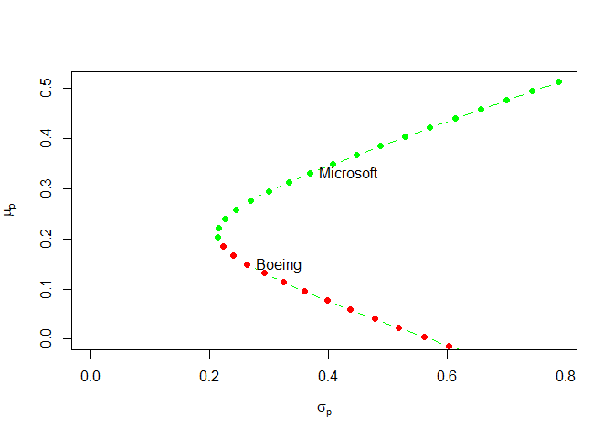
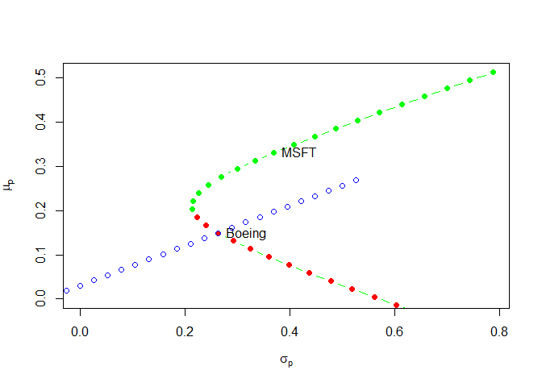
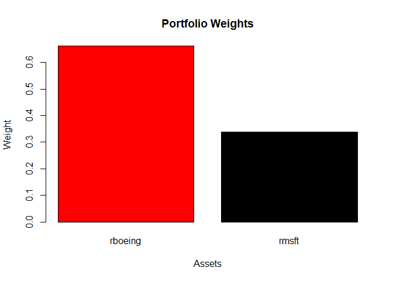
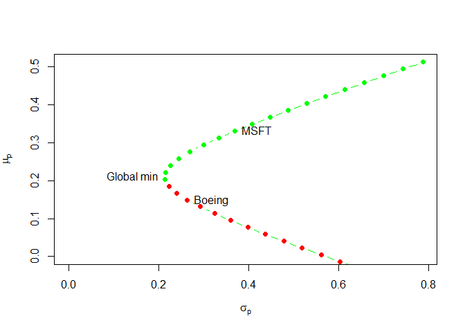
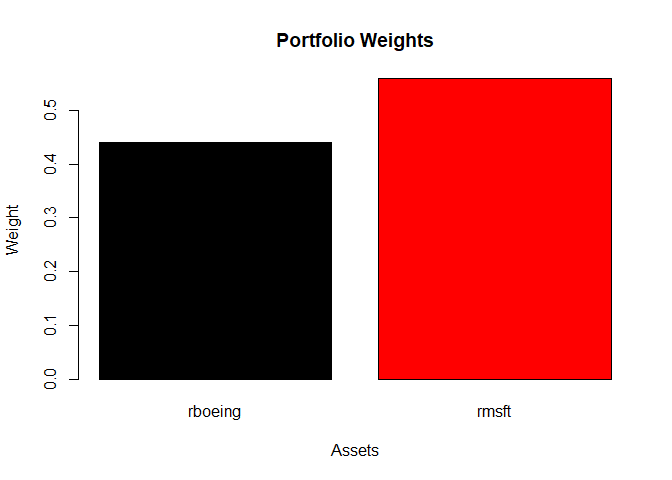
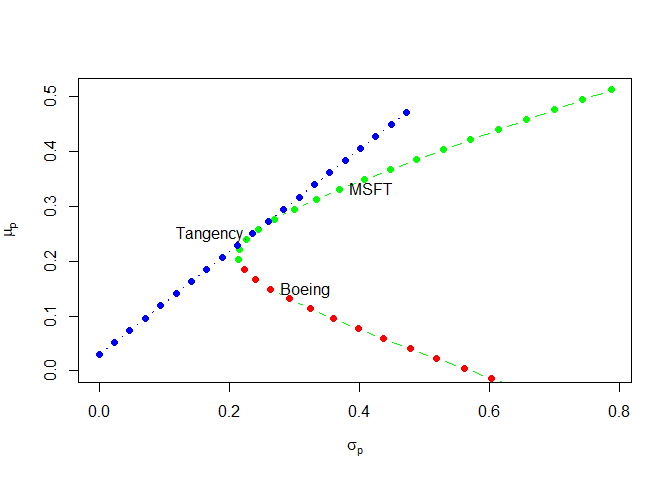
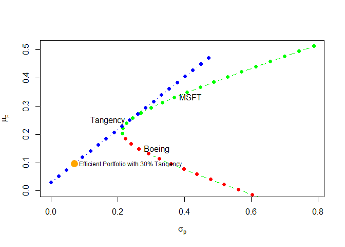
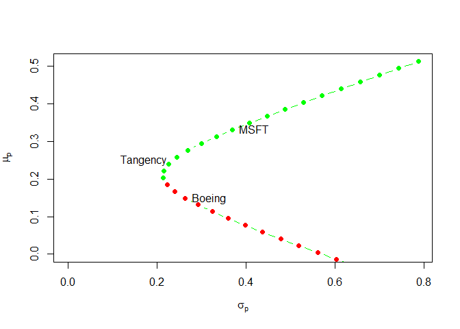

# Lab 7 Introduction to portfolio theory

https://campus.datacamp.com/courses/computational-finance-and-financial-econometrics-with-r/lab-7-introduction-to-portfolio-theory?ex=1

https://rdrr.io/rforge/IntroCompFinR/api/

## Loading in your data set

This lab introduces you to portfolio theory. Let us get started by loading the <code>returns_df</code> data set into your workspace. This data set contains the returns on the Boeing and Microsoft stock from 1992-07-01 up to 2000-10-01.

You can find the data set at http://s3.amazonaws.com/assets.datacamp.com/course/compfin/lab8.RData.

Instructions
Load the data with the help of the <code>load</code> function.
Use <code>head</code> and <code>tail</code> to explore the returns_df data set.


```r
# Load relevant packages
library("PerformanceAnalytics")
library("zoo")

# Load the data
load(url("http://s3.amazonaws.com/assets.datacamp.com/course/compfin/lab8.RData"))

# Explore the data set
head(returns_df)
```

```
##                 rboeing       rmsft
## 1992-07-01  0.003133855  0.03853916
## 1992-08-01 -0.071232544  0.02375398
## 1992-09-01 -0.013508615  0.07745886
## 1992-10-01 -0.020622782  0.09758069
## 1992-11-01 -0.024602276  0.04811259
## 1992-12-01  0.133085160 -0.08689424
```

```r
tail(returns_df)
```

```
##                rboeing      rmsft
## 2000-05-01 -0.01221301 -0.1087514
## 2000-06-01  0.06803470  0.2458606
## 2000-07-01  0.15478898 -0.1362136
## 2000-08-01  0.09720903  0.0000000
## 2000-09-01  0.18435738 -0.1462737
## 2000-10-01  0.05008115  0.1327539
```

## The CER model

A quick recap on the constant expected return model (CER) as seen in the previous chapter:

$$R_{it}=\mu_i+\epsilon_{it}, \quad with \quad t=1,.,T$$
$$\epsilon_{it}\sim iid N(0,\epsilon_i^2)$$
$$cov(\epsilon_{it},\epsilon_{jt})=\sigma_{ij}$$
where $R_{it}$ denotes the continuously compounded return on asset ii, now with i=i= Microsoft and Boeing.

As discussed in the previous chapter, the parameters $\mu_i$, $\sigma_i$ and $\rho_{ij}$ are unknown to us. However, you can estimate the model parameters for both the Boeing and the Microsoft stock based on the data in <code>returns_df</code>.

### Instructions

Assign to <code>sigma2_annual</code> the estimates of $\sigma_{i}$ for both assets (i.e. $i=$ Boeing and Microsoft respectively). Calculate the corresponding $\hat{\sigma_{i}}$ as well and assign it to <code>sigma_annual</code>.
The annual CER model parameters for Boeing are provided. Calculate those for Microsoft as well.
Estimate the correlations $\rho_{ij}$ between both stocks and assign the result to <code>rho_boeing_msft</code>.


```r
# The returns_df data is preloaded in your workspace

# Estimate the parameters: multivariate
mu_hat_annual <- apply(returns_df, 2, mean) * 12
sigma2_annual <- apply(returns_df, 2, var)*12
sigma_annual <- sqrt(sigma2_annual)
cov_mat_annual <- cov(returns_df) * 12
cov_hat_annual <- cov(returns_df)[1,2] * 12
rho_hat_annual <- cor(returns_df)[1,2]

# The annual estimates of the CER model parameters for Boeing and Microsoft
mu_boeing <- mu_hat_annual["rboeing"]
mu_msft <- mu_hat_annual["rmsft"]
sigma2_boeing <-  sigma2_annual["rboeing"]
sigma2_msft <- sigma2_annual["rmsft"]
sigma_boeing <- sigma_annual["rboeing"]
sigma_msft <- sigma_annual["rmsft"]
sigma_boeing_msft <- cov_hat_annual
rho_boeing_msft <- rho_hat_annual
```

## A portfolio of Boeing and Microsoft stock

In this exercise, you will create a set of portfolios that consist of Microsoft and Boeing stock. The goal is to visualize all these portfolios in a plot with on the x-axis the portfolio standard deviation and on the y-axis the expected return on the portfolio.

The code on the right specifies the vector <code>boeing_weights</code>. Every element of the vector <code>boeing_weights</code> represents the proportion of Boeing stocks for that portfolio. The set of weights for Boeing that you will consider ranges from -1, -0.9, ..., up to 2.

### Instructions

* The <code>boeing_weights</code> variable is given. Calculate the corresponding value of <code>msft_weights</code> and take into account that the sum of the portfolio weights should be one.
* Assign to <code>mu_portfolio</code> the expected portfolio returns ($\mu_p$) for each set of portfolio weights.
* Assign to <code>sigma2_portfolio</code> the portfolio variances ($\sigma_p^2$) for each set of portfolio weights.
* Have a look at the code to generate the plot on the right. Add the label <code>"Boeing"</code> and <code>"Microsoft"</code> on the right place in the risk-return plot. Are you not sure what is happening there? Have a look at the documentation of the text() function.


```r
# All data and CER parameters are preloaded in your workspace.
# Type ls() in the console to see them.

# The ratio Boeing stock vs Microsoft stock (adds up to 1)
boeing_weights <- seq(from = -1, to = 2, by = 0.1)
msft_weights <- 1 - boeing_weights

# Portfolio parameters
mu_portfolio <- boeing_weights * mu_boeing + msft_weights * mu_msft
sigma2_portfolio <- boeing_weights^2 * sigma2_boeing + msft_weights^2 * sigma2_msft + 2*boeing_weights*msft_weights*sigma_boeing_msft
sigma_portfolio <- sqrt(sigma2_portfolio)

# Plotting the different portfolios
plot(sigma_portfolio, mu_portfolio, type = "b", pch = 16, ylim = c(0, max(mu_portfolio)), xlim = c(0, max(sigma_portfolio)), xlab = expression(sigma[p]), ylab = expression(mu[p]), col = c(rep("green", 18), rep("red", 13)))
text(x = sigma_boeing, y = mu_boeing, labels = "Boeing", pos = 4)
text(x = sigma_msft, y = mu_msft, labels = "Microsoft", pos = 4)
```

<!-- -->

## Adding T-bills to your portfolios

As seen in the lectures, you can potentially increase the performance of your portfolio significantly by investing in T-bills as well.

Use an annual risk-free rate of 3% per year for the T-billand and create a set of portfolios with the T-bills and the Boeing stock as underlying assets. Again, you are allowed to take short positions in both assets.

### Instructions

* Assign to <code>t_bill_rate</code> the annual risk-free rate of 3%.
* Calculate the expected portfolio return and portfolio variance for this set of portfolios.
* Add these new portfolio combinations to the plot that you constructed in the previous exercise with the help of <code>points</code>. For the color code argument use <code>col = "blue"</code>, for the type use <code>type = "b"</code>.


```r
# All data and CER parameters are preloaded in your workspace.
# Type ls() in the console to see them.

# Annual risk-free rate of 3% per year for the T-bill
t_bill_rate <- 0.03

# Ratio Boeing stocks
boeing_weights <- seq(from = -1, to = 2, by = 0.1)

# Portfolio parameters
mu_portfolio_boeing_bill <- t_bill_rate + boeing_weights*(mu_boeing - t_bill_rate)
sigma_portfolio_boeing_bill <- boeing_weights*sigma_boeing

# Plot previous exercise
plot(sigma_portfolio, mu_portfolio, type = "b", pch = 16, ylim = c(0, max(mu_portfolio)), xlim = c(0, max(sigma_portfolio)), xlab = expression(sigma[p]), ylab = expression(mu[p]), col = c(rep("green", 18), rep("red", 13)))
text(x = sigma_boeing, y = mu_boeing, labels = "Boeing", pos = 4)
text(x = sigma_msft, y = mu_msft, labels = "MSFT", pos = 4)

# Portfolio Combination Boeing and T-bills
points(sigma_portfolio_boeing_bill, mu_portfolio_boeing_bill, type="b", col="blue")
```

<!-- -->

## The Sharpe Slope

Having a value for the T-bill annual risk-free rate, you can now calculate the Sharpe slope for the Boeing stock.

### Instructions

* Calculate the Sharpe slope for Boeing and assign your result to <code>sharp_ratio_boeing</code>.


```r
# All data and CER parameters are preloaded in your workspace.
# Type ls() in the console to see them.

# Sharp ratio Boeing
sharp_ratio_boeing <- (mu_boeing - t_bill_rate)/sigma_boeing
sharp_ratio_boeing
```

```
##   rboeing 
## 0.4521453
```

## Global Minimum Variance Portfolio

The global minimum variance portfolio is the portfolio that provides you with the lowest possible portfolio volatility for a number of underlying assets. To calculate the global minimum variance portfolio for our <code>returns_df</code> data set, you can make use of the R function <code>globalMin.portfolio()</code>.

The <code>globalMin.portfolio()</code> function only needs two inputs:

* The <code>er</code> argument: the expected returns of the underlying assets (that is <code>mu_hat_annual</code> in this case).
* The <code>cov.mat</code> argument: the covariance matrix of the returns (that is <code>cov_mat_annual</code> in this case).
Both <code>mu_hat_annual</code> and <code>cov_mat_annual</code> were calculated in a previous exercise and are preloaded in your workspace.

### Instructions

* Assign the global minimum variance portfolio to <code>global_min_var_portfolio</code> and print the result to the console.
* Apply the <code>summary()</code> function to <code>global_min_var_portfolio</code>. Set the <code>risk.free</code> argument to 3% to get the portfolio Sharpe ratio.
* Make a plot with the <code>plot()</code> function that shows the weight of Boeing and Microsoft in global minimum variance portfolio.


```r
# https://rdrr.io/rforge/IntroCompFinR/src/R/globalMin.portfolio.R

globalMin.portfolio <- function(er, cov.mat, shorts=TRUE)
{
  call <- match.call()

  #
  # check for valid inputs
  #
  asset.names <- names(er)
  er <- as.vector(er) # assign names if none exist
  cov.mat <- as.matrix(cov.mat)
  N <- length(er)
  if(N != nrow(cov.mat))
    stop("invalid inputs")
  if(any(diag(chol(cov.mat)) <= 0))
    stop("Covariance matrix not positive definite")
  # remark: could use generalized inverse if cov.mat is positive semi-definite

  #
  # compute global minimum portfolio
  #
  if(shorts==TRUE){
    cov.mat.inv <- solve(cov.mat)
    one.vec <- rep(1,N)
    w.gmin <- rowSums(cov.mat.inv) / sum(cov.mat.inv)
    w.gmin <- as.vector(w.gmin)
  } else if(shorts==FALSE){
    Dmat <- 2*cov.mat
    dvec <- rep.int(0, N)
    Amat <- cbind(rep(1,N), diag(1,N))
    bvec <- c(1, rep(0,N))
    result <- quadprog::solve.QP(Dmat=Dmat,dvec=dvec,Amat=Amat,bvec=bvec,meq=1)
    w.gmin <- round(result$solution, 6)
  } else {
    stop("shorts needs to be logical. For no-shorts, shorts=FALSE.")
  }
 
  names(w.gmin) <- asset.names
  er.gmin <- crossprod(w.gmin,er)
  sd.gmin <- sqrt(t(w.gmin) %*% cov.mat %*% w.gmin)
  gmin.port <- list("call" = call,
		    "er" = as.vector(er.gmin),
		    "sd" = as.vector(sd.gmin),
		    "weights" = w.gmin)
  class(gmin.port) <- "portfolio"
  gmin.port
}

# https://rdrr.io/rforge/IntroCompFinR/src/R/plot.portfolio.R

plot.portfolio <- function(x, ...)
{
  asset.names <- names(x$weights)
  barplot(x$weights, names=asset.names,
	  xlab="Assets", ylab="Weight", main="Portfolio Weights", ...)
  invisible()
}
```


```r
# All data and CER parameters are preloaded in your workspace.
# Type ls() in the console to see them.

# The global minimum variance portfolio
global_min_var_portfolio <- globalMin.portfolio(mu_hat_annual, cov_mat_annual)
global_min_var_portfolio
```

```
## $call
## globalMin.portfolio(er = mu_hat_annual, cov.mat = cov_mat_annual)
## 
## $er
## [1] 0.2105954
## 
## $sd
## [1] 0.2139033
## 
## $weights
##   rboeing     rmsft 
## 0.6619557 0.3380443 
## 
## attr(,"class")
## [1] "portfolio"
```

```r
# Summary of global_min_var_portfolio that takes into account the annual risk-free rate of 3% per year
summary(global_min_var_portfolio, risk.free=0.03)
```

```
##         Length Class  Mode   
## call    3      -none- call   
## er      1      -none- numeric
## sd      1      -none- numeric
## weights 2      -none- numeric
```

```r
# Portfolio weights Boeing and Microsoft
plot(global_min_var_portfolio, col=as.factor(global_min_var_portfolio$weights))
```

<!-- -->

```r
global_min_var_portfolio$weights
```

```
##   rboeing     rmsft 
## 0.6619557 0.3380443
```

```r
# Plot previous exercises
plot(sigma_portfolio, mu_portfolio, type="b", pch=16, ylim=c(0, max(mu_portfolio)), xlim=c(0, max(sigma_portfolio)), xlab=expression(sigma[p]), ylab=expression(mu[p]), col=c(rep("green", 18), rep("red", 13)))
text(x=sigma_boeing, y=mu_boeing, labels="Boeing", pos=4)
text(x=sigma_msft, y=mu_msft, labels="MSFT", pos=4)

# Plot the position of the global minimum variance portfolio
text(x=global_min_var_portfolio$sd, y=global_min_var_portfolio$er, labels="Global min", pos=2)
```

<!-- -->

### Expected return

What is the expected return of the global minimum variable portfolio?

Note that all data and CER parameters are preloaded in your workspace. Type <code>ls()</code>. in the console to see them.


```r
#er
#0.2106
```

## Tangency Portfolio

The tangency portfolio is the portfolio on the efficient frontier with the highest Sharpe ratio. In this exercise you will calculate the composition of the tangency portfolio, taking into account investment options in Boeing and Microsoft stock. To do this, you will make use of the <code>tangency.portfolio()</code> function.

More specifically, <code>tangency.portfolio()</code> has the arguments:

* <code>er</code>: the expected returns (<code>mu_hat_annual</code>)
* <code>cov.mat</code>: the covariance matrix of the returns (<code>cov_mat_annual</code>)
* <code>risk.free</code>: the risk-free rate (3% in this case).

### Instructions

* Assign the tangency portfolio to <code>tangency_portfolio</code> and print the result.
* Study the <code>summary</code> of <code>tangency_portfolio</code>. Take into account a risk-free rate of 3%.
* Make a plot with the <code>plot()</code> function that shows the weight of Boeing and Microsoft in the tangency portfolio.


```r
# https://rdrr.io/rforge/IntroCompFinR/src/R/tangency.portfolio.R
tangency.portfolio <- function(er,cov.mat,risk.free, shorts=TRUE)
{
  call <- match.call()

  #
  # check for valid inputs
  #
  asset.names <- names(er)
  if(risk.free < 0)
    stop("Risk-free rate must be positive")
  er <- as.vector(er)
  cov.mat <- as.matrix(cov.mat)
  N <- length(er)
  if(N != nrow(cov.mat))
    stop("invalid inputs")
  if(any(diag(chol(cov.mat)) <= 0))
    stop("Covariance matrix not positive definite")
  # remark: could use generalized inverse if cov.mat is positive semi-definite

  #
  # compute global minimum variance portfolio
  #
  gmin.port <- globalMin.portfolio(er, cov.mat, shorts=shorts)
  if(gmin.port$er < risk.free)
    stop("Risk-free rate greater than avg return on global minimum variance portfolio")

  # 
  # compute tangency portfolio
  #
  if(shorts==TRUE){
    cov.mat.inv <- solve(cov.mat)
    w.t <- cov.mat.inv %*% (er - risk.free) # tangency portfolio
    w.t <- as.vector(w.t/sum(w.t))          # normalize weights
  } 
  else if(shorts==FALSE){
    Dmat <- 2*cov.mat
    dvec <- rep.int(0, N)
    er.excess <- er - risk.free
    Amat <- cbind(er.excess, diag(1,N))
    bvec <- c(1, rep(0,N))
    result <- quadprog::solve.QP(Dmat=Dmat,dvec=dvec,Amat=Amat,bvec=bvec,meq=1)
    w.t <- round(result$solution/sum(result$solution), 6)
  }
  else {
    stop("Shorts needs to be logical. For no-shorts, shorts=FALSE.")
  }
    
  names(w.t) <- asset.names
  er.t <- crossprod(w.t,er)
  sd.t <- sqrt(t(w.t) %*% cov.mat %*% w.t)
  tan.port <- list("call" = call, "er" = as.vector(er.t), "sd" = as.vector(sd.t), "weights" = w.t)
  class(tan.port) <- "portfolio"
  return(tan.port)
}
```


```r
# All data and CER parameters are preloaded in your workspace.
# Type ls() in the console to see them.

# The tangency portfolio
tangency_portfolio <- tangency.portfolio(mu_hat_annual, cov_mat_annual,risk.free=0.03) 

# Print out tangency portfolio
tangency_portfolio
```

```
## $call
## tangency.portfolio(er = mu_hat_annual, cov.mat = cov_mat_annual, 
##     risk.free = 0.03)
## 
## $er
## [1] 0.2507215
## 
## $sd
## [1] 0.2364756
## 
## $weights
##   rboeing     rmsft 
## 0.4409234 0.5590766 
## 
## attr(,"class")
## [1] "portfolio"
```

```r
# Summary of tangency_portfolio with annual risk free rate of 3%
summary(tangency_portfolio ,risk.free=0.03)
```

```
##         Length Class  Mode   
## call    4      -none- call   
## er      1      -none- numeric
## sd      1      -none- numeric
## weights 2      -none- numeric
```

```r
# Portfolio weights Boeing and Microsoft
plot(tangency_portfolio, col=as.factor(tangency_portfolio$weights))
```

<!-- -->

## Tangency portfolio and T-bills

In the previous exercise, you calculated the composition of the tangency portfolio. As a second step, you create new portfolios that are a combination of T-bills and this tangency portfolio. First, you will need to compute the expected portfolio return and volatility for these portfolios. Second, your job is to create a plot of these portfolios with the volatility on the x-axis and the expected return on the y-axis.

### Instructions

* Calculate the expected portfolio returns <code>mu_portfolio_tangency_bill</code> and portfolio volatilities <code>sigma_portfolio_tangency_bill</code> for the set of weights and indicate the proportion that was invested in the tangency portfolio (<code>tangency_weights</code>).
* Add these new portfolios to the plot that you constructed in the previous exercise with the help of the <code>points()</code> function. For the color code argument use <code>col = "blue"</code>, for the type use <code>type = "b"</code>, and as a plotting character use <code>pch = 16</code>.


```r
# All data and CER parameters are preloaded in your workspace.
# Type ls() in the console to see them.

# Annual risk-free rate of 3% per year for the T-bill
t_bill_rate <- 0.03

# Set of tangency portfolio weights
tangency_weights <- seq(from = 0, to = 2, by = 0.1)

# Portfolio parameters
mu_portfolio_tangency_bill <- t_bill_rate + tangency_weights*(tangency_portfolio$er-t_bill_rate)
sigma_portfolio_tangency_bill <- tangency_weights*tangency_portfolio$sd

# Plot previous exercises
plot(sigma_portfolio, mu_portfolio, type = "b", pch = 16, ylim = c(0, max(mu_portfolio)), xlim = c(0, max(sigma_portfolio)),
     xlab = expression(sigma[p]), ylab = expression(mu[p]), col = c(rep("green", 18), rep("red", 13)))
text(x = sigma_boeing, y = mu_boeing, labels = "Boeing", pos = 4)
text(x = sigma_msft, y = mu_msft, labels = "MSFT", pos = 4)

# Plot portfolio combinations of tangency portfolio and T-bills
text(x=tangency_portfolio$sd, y=tangency_portfolio$er, labels="Tangency", pos=2)
points(sigma_portfolio_tangency_bill, mu_portfolio_tangency_bill, type="b", col="blue", pch=16)
```

<!-- -->

## An Efficient Portfolio with 30% Tangency

Consider a portfolio that has 30% invested in the tangency portfolio and 70% in T-bills. Before making the final call, you want to investigate this portfolio's return and volatility in more detail. You decide to use the techniques that you learned in the previous exercises to map the portfolio in the spectrum of available portfolios.

### Instructions

* Set the <code>tangency_weight</code> to <code>0.3</code> and then determine the <code>t_bill_weight</code>.
* Assign to <code>mu_portfolio_efficient</code> the expected portfolio return and to <code>sd_portfolio_efficient</code> the portfolio standard deviation.
* Plot this portfolio using <code>points</code>. Use "orange"" as the color for the line, the type is "b", the plotting character is 16, and apply a character expansion <code>cex</code> of 2. The corresponding <code>text()</code> function is already provided.


```r
# All data and CER parameters are preloaded in your workspace.
# Type ls() in the console to see them.

# Define the portfolio ratio's
tangency_weight <- 0.3
t_bill_weight <- 1 - tangency_weight

# Define the portfolio parameters
mu_portfolio_efficient <- t_bill_rate + tangency_weight*(tangency_portfolio$er - t_bill_rate)

sd_portfolio_efficient <- tangency_weight * tangency_portfolio$sd

# Plot previous exercises
plot(sigma_portfolio, mu_portfolio, type="b", pch=16, ylim=c(0, max(mu_portfolio)), xlim=c(0, max(sigma_portfolio)), xlab=expression(sigma[p]), ylab=expression(mu[p]),col=c(rep("green", 18), rep("red", 13)))
text(x=sigma_boeing, y=mu_boeing, labels="Boeing", pos=4)
text(x=sigma_msft, y=mu_msft, labels="MSFT", pos=4)
text(x=tangency_portfolio$sd, y=tangency_portfolio$er, labels="Tangency", pos=2)
points(sigma_portfolio_tangency_bill, mu_portfolio_tangency_bill, type="b", col="blue", pch=16)

# Plot Efficient Portfolio with 30% Tangency
points(sd_portfolio_efficient, mu_portfolio_efficient, type="p", col="orange", pch=16, cex=2)
text(x=sd_portfolio_efficient, y=mu_portfolio_efficient, labels="Efficient Portfolio with 30% Tangency", pos=4, cex=0.75)
```

<!-- -->

## An Efficient Portfolio with the SD of Boeing

In this final exercise, you want to find the efficient portfolio (combination of T-bills and tangency portfolio) that has the same risk (SD) as Boeing.

### Instructions

* Assign the weight of the tangency portfolio to <code>tangency_weight</code>.
* Calculate the portfolio parameters for this portfolio and assign them to <code>mu_portfolio_efficient</code> and <code>sd_portfolio_efficient</code>.
* Have a look at the plot.


```r
# All data and CER parameters are preloaded in your workspace.
# Type ls() in the console to see them.

# Calculate the weight of the tangency portfolio in the portfolio
tangency_weight <- sigma_boeing / tangency_portfolio$sd

# Calculate the portfolio parameters
mu_portfolio_efficient <- t_bill_rate + tangency_weight*(tangency_portfolio$er - t_bill_rate)

sd_portfolio_efficient <- tangency_weight*tangency_portfolio$sd

# Plot previous exercises
plot(sigma_portfolio, mu_portfolio, bg = "NA", type = "b", pch = 16, ylim = c(0, max(mu_portfolio)), xlim = c(0, max(sigma_portfolio)), xlab = expression(sigma[p]), ylab = expression(mu[p]), col = c(rep("green", 18), rep("red", 13)))
text(x = sigma_boeing, y = mu_boeing, labels = "Boeing", pos = 4)
text(x = sigma_msft, y = mu_msft, labels = "MSFT", pos = 4)
text(x = tangency_portfolio$sd, y = tangency_portfolio$er, labels = "Tangency", pos = 2)
```

<!-- -->


