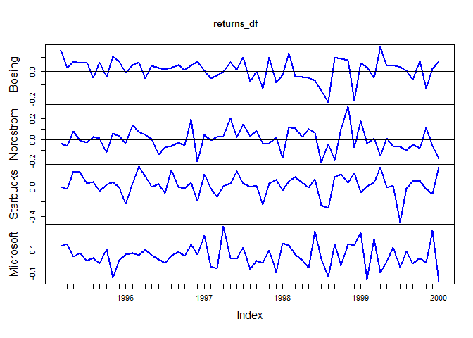
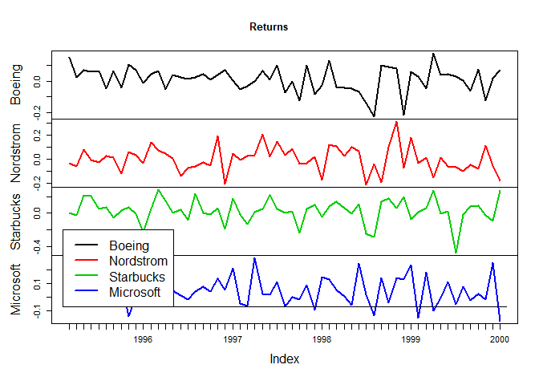
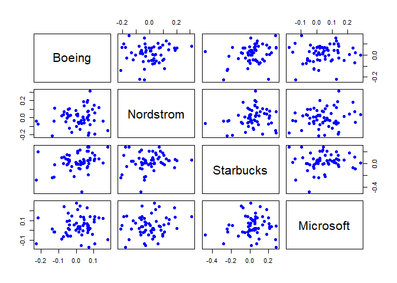
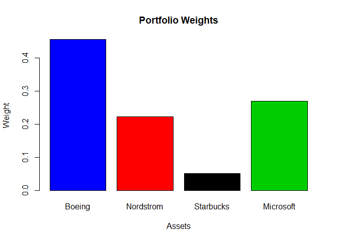
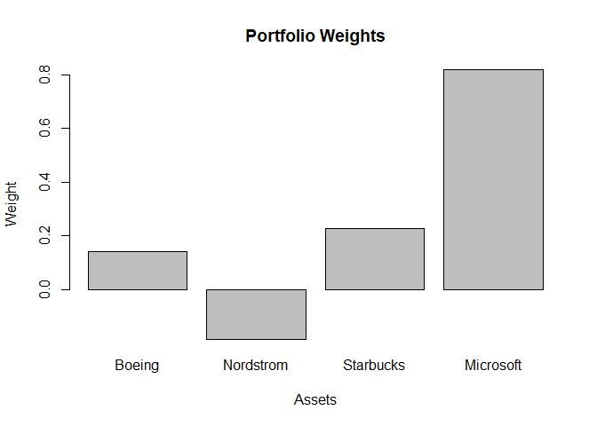
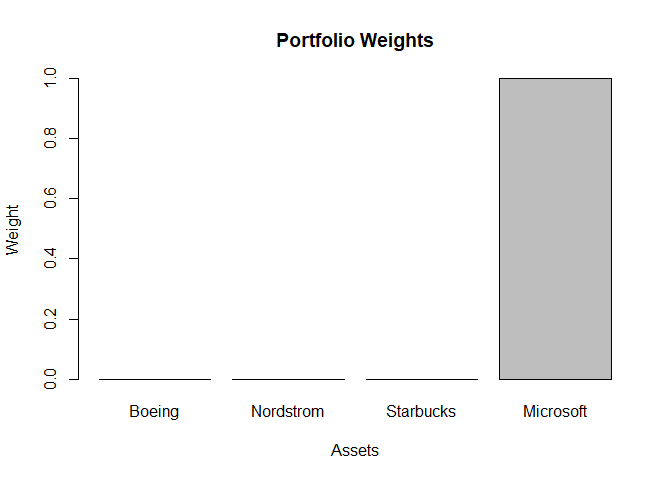
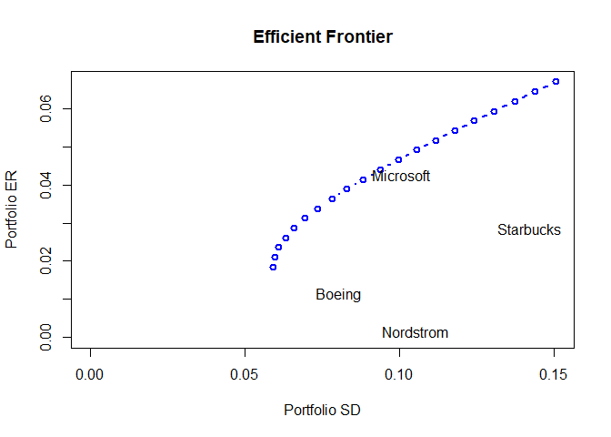
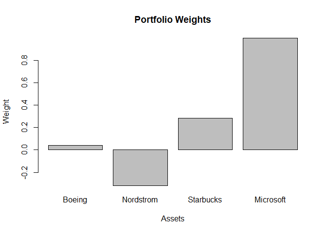
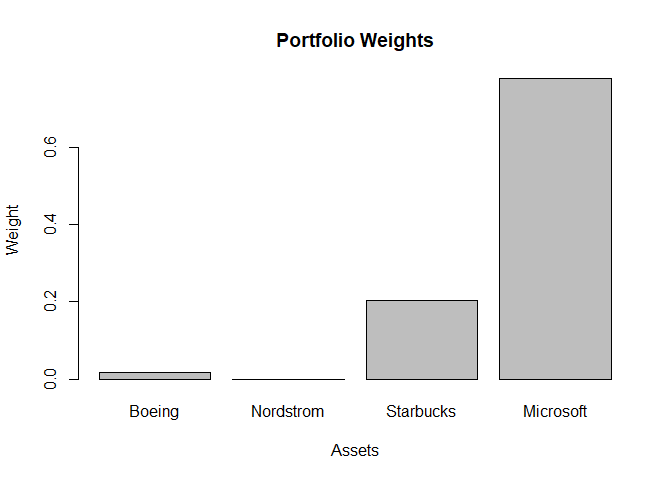

# Lab 8 Computing efficient portfolios using matrix algebra

https://campus.datacamp.com/courses/computational-finance-and-financial-econometrics-with-r/lab-8-computing-efficient-portfolios-using-matrix-algebra?ex=1

## Loading in your data set

In this final lab you continue your exploration of portfolio theory. Let us first load the data set <code>returns_df</code> into the workspace. This data set contains the monthly returns on the Boeing, Nordstrom, Starbucks and Microsoft stock from March 1995 up to January 2000.

You can find the data set at http://s3.amazonaws.com/assets.datacamp.com/course/compfin/lab9.RData.

### Instructions

* Load the working environment that contains the data set with the help of <code>load()</code>.
* Use <code>head()</code> and <code>tail()</code> to explore the <code>returns_df</code> data set.
* The code chunks to create the timeplots of stocks on separate charts or within the same graph are provided. Make sure to have a close look at these.


```r
# All data and CER parameters are preloaded in your workspace.  Type ls() in the console to see them.

# Load the relevant packages
library("zoo")

# Load the working environment
load(url("http://s3.amazonaws.com/assets.datacamp.com/course/compfin/lab9.RData"))

# Explore the data set
head(returns_df)
```

```
##               Boeing    Nordstrom    Starbucks   Microsoft
## Mar 1995  0.15298607 -0.036153005  0.005213567 0.121301354
## Apr 1995  0.02299286 -0.056796794 -0.021053409 0.139234622
## May 1995  0.06808216  0.078207541  0.212444821 0.035293766
## Jun 1995  0.06174698 -0.003016273  0.203596782 0.065005425
## Jul 1995  0.06752700 -0.027569065  0.047965358 0.001379957
## Aug 1995 -0.04580883  0.027675498  0.067872071 0.021858794
```

```r
tail(returns_df)
```

```
##                Boeing   Nordstrom   Starbucks   Microsoft
## Aug 1999  0.001665287 -0.10216616 -0.01626052  0.07571941
## Sep 1999 -0.061141114 -0.04746691  0.08004069 -0.02184387
## Oct 1999  0.077557988 -0.07946425  0.09267201  0.02184387
## Nov 1999 -0.122442331  0.11217318 -0.02325686 -0.01650933
## Dec 1999  0.019801998 -0.05544145 -0.09108383  0.24866014
## Jan 2000  0.071301969 -0.17900166  0.27731929 -0.17634374
```

```r
# Timeplots with stocks on individual graphs
my.panel <- function(...) {
  lines(...)
  abline(h = 0)
}
plot(returns_df, lwd = 2, panel = my.panel, col = "blue")
```

<!-- -->

```r
# Timeplots with stocks on same graph
plot(returns_df, main = "Returns", col = 1:4, lwd = 2)
abline(h = 0)
legend(x = "bottomleft", legend = colnames(returns_df), col = 1:4, lwd = 2)
```

<!-- -->

## The CER model

Before diving into the actual arithmetics, you first need to calculate the parameters of the constant expected return model (CER). Make use of the data in <code>returns_df</code> to estimate the model parameters for all four stocks.

### Instructions

* Assign to <code>sigma2_month</code> the estimates of $\sigma_i^2$ for all four assets.
* Calculate <code>sigma_month</code>, the estimates of $\sigma_i$ for all four assets.
* Estimate the correlations $\rho_{ij}$ between all stocks, and assign the result to <code>cor_mat_month</code>.
* Create the pairwise scatterplots between all four stocks. Use <code>coredata()</code> to extract the core data from returns_df and <code>pairs()</code> to create a matrix of scatter plots. Take the color <code>blue</code> and use 16 for points <code>pch</code>.


```r
# All data is preloaded in your workspace.  Type ls() in the console to see what has been loaded.

# Parameters CER model
mu_hat_month <- apply(returns_df, 2, mean)
mu_hat_month
```

```
##      Boeing   Nordstrom   Starbucks   Microsoft 
## 0.011300419 0.001545065 0.028460847 0.042711830
```

```r
sigma2_month <- apply(returns_df, 2, var)
sigma2_month
```

```
##      Boeing   Nordstrom   Starbucks   Microsoft 
## 0.006475909 0.011120975 0.020212207 0.010122211
```

```r
sigma_month <- apply(returns_df, 2, sd)
sigma_month
```

```
##     Boeing  Nordstrom  Starbucks  Microsoft 
## 0.08047303 0.10545603 0.14216964 0.10060920
```

```r
cov_mat_month <- var(returns_df)
cov_mat_month
```

```
##                 Boeing    Nordstrom   Starbucks    Microsoft
## Boeing    0.0064759087 0.0008699794 0.003473484 0.0006925628
## Nordstrom 0.0008699794 0.0111209750 0.002636127 0.0018502818
## Starbucks 0.0034734841 0.0026361272 0.020212207 0.0011305061
## Microsoft 0.0006925628 0.0018502818 0.001130506 0.0101222108
```

```r
cor_mat_month <- cor(returns_df)
cor_mat_month
```

```
##               Boeing Nordstrom  Starbucks  Microsoft
## Boeing    1.00000000 0.1025149 0.30360442 0.08554037
## Nordstrom 0.10251495 1.0000000 0.17582801 0.17439288
## Starbucks 0.30360442 0.1758280 1.00000000 0.07903662
## Microsoft 0.08554037 0.1743929 0.07903662 1.00000000
```

```r
# Pairwise scatterplots
pairs(coredata(returns_df), col="blue", pch=16)
```

<!-- -->

## Correlation

What is the correlation between the Nordstrom stock and the Boeing stock?

*Note that all data and CER parameters are preloaded in your workspace. Type <code>ls()</code> in the console to see them.*


```r
cor_mat_month
```

```
##               Boeing Nordstrom  Starbucks  Microsoft
## Boeing    1.00000000 0.1025149 0.30360442 0.08554037
## Nordstrom 0.10251495 1.0000000 0.17582801 0.17439288
## Starbucks 0.30360442 0.1758280 1.00000000 0.07903662
## Microsoft 0.08554037 0.1743929 0.07903662 1.00000000
```

```r
0.1025
```

```
## [1] 0.1025
```

## The global minimum variance portfolio - Part One

In the previous lab you already determined the global minimum variance portfolio if short sales are allowed.

Let us do a quick recap here: use <code>globalMin.portfolio()</code> to calculate the global minimum variance portfolio for your four stocks when you are allowed to take short positions.

###Instructions

* Use the <code>globalMin.portfolio()</code> function to calculate the global minimum variance portfolio here.
* Use <code>plot()</code> to visualize the weights of your four stocks in the global minimum variance portfolio.


```r
# All data and CER parameters are preloaded in your workspace.  Type ls() in the console to see them.

# Calculate the global minimum variance portfolio
global_min_var_portfolio <- globalMin.portfolio(mu_hat_month, cov_mat_month,shorts=TRUE)
global_min_var_portfolio
```

```
## Call:
## globalMin.portfolio(er = mu_hat_month, cov.mat = cov_mat_month, 
##     shorts = TRUE)
## 
## Portfolio expected return:     0.01846121 
## Portfolio standard deviation:  0.05927073 
## Portfolio weights:
##    Boeing Nordstrom Starbucks Microsoft 
##    0.4562    0.2233    0.0512    0.2693
```

```r
# Plot the portfolio weights of our four stocks
plot(global_min_var_portfolio, col=as.factor(global_min_var_portfolio$weights))
```

<!-- -->

## Standard deviation

What is the standard deviation of the global minimum variance portfolio that you have just calculated?

*Note that all data and CER parameters are preloaded in your workspace. Type <code>ls()</code> in the console to see them.*


```r
global_min_var_portfolio
```

```
## Call:
## globalMin.portfolio(er = mu_hat_month, cov.mat = cov_mat_month, 
##     shorts = TRUE)
## 
## Portfolio expected return:     0.01846121 
## Portfolio standard deviation:  0.05927073 
## Portfolio weights:
##    Boeing Nordstrom Starbucks Microsoft 
##    0.4562    0.2233    0.0512    0.2693
```

```r
0.0593
```

```
## [1] 0.0593
```

## The global minimum variance portfolio - Part Two

Now you want to construct the global minimum variance portfolio under the condition that short sales are not allowed. The Markowitz portfolio optimization problem for the minimum variance portfolio with no short sales restrictions can be described as follows:

<center>$\min\limits_x \sigma_{p,x}^2=x^\prime\sum x$, subject to</center>


$$x^\prime 1=1$$

$$x_i \geq 0,$$
with $x$ the vector of portfolio weights, $\sigma_{p,x}^2$ and $\mu_{p,x}$ the portfolio variance and expected return respectively, $\mu$ the vector of expected returns and $\sum$ the covariance matrix of the returns.

As seen in the lectures, the portfolio optimization problem with inequality constraints can be set up as a quadratic programming problem. Quadratic programming problems are of the form:
<center>$\min\limits_x \frac{1}{2}x^\prime Dx-d^\prime x$, subject to</center>
<center>$A_{neq}^\prime x \geq b_{neq}$, for m inequality constraints, and </center>
<center>$A_{eq}^\prime x=b_{neq}$, for $l$ equality constraints,</center>

where $D$ is a $n \times n$ matrix, $x$ and $d$ are $n \times 1$ vectors, $A^\prime_{neq}$ is an $m \times n$ matrix, $b_{neq}$ is an $m \times 1$ vector, $A^\prime_{eq}$ is an $l \times n$ matrix, and $b_{eq}$ is an $l \times 1$ vector.

Quadratic programming problems can be solved with the R package <code>quadprog</code> and the <code>solve.QP()</code> function. In the next exercise you will discover a more easy way to do this with the help of <code>globalMin.portfolio()</code>.

### Instructions

* The restriction matrices are already set up. Make sure to study their output.
* Use these restriction matrices and the global minimum variance portfolio equality constraint to minimize the portfolio variance via <code>solve.QP()</code>. Assign the result to <code>quad_prog</code>.


```r
library(quadprog)
# All data and CER parameters are preloaded in your workspace.  Type ls() in the console to see them.

# set restriction matrices
D_matrix <- 2 * cov_mat_month
D_matrix
```

```
##                Boeing   Nordstrom   Starbucks   Microsoft
## Boeing    0.012951817 0.001739959 0.006946968 0.001385126
## Nordstrom 0.001739959 0.022241950 0.005272254 0.003700564
## Starbucks 0.006946968 0.005272254 0.040424414 0.002261012
## Microsoft 0.001385126 0.003700564 0.002261012 0.020244422
```

```r
d_vector <- rep(0, 4)
d_vector
```

```
## [1] 0 0 0 0
```

```r
A_matrix <- cbind(rep(1, 4), diag(4))
A_matrix
```

```
##      [,1] [,2] [,3] [,4] [,5]
## [1,]    1    1    0    0    0
## [2,]    1    0    1    0    0
## [3,]    1    0    0    1    0
## [4,]    1    0    0    0    1
```

```r
b_vector <- c(1, rep(0, 4))
b_vector
```

```
## [1] 1 0 0 0 0
```

```r
# use solve.QP to minimize portfolio variance
quad_prog <- solve.QP(Dmat = D_matrix,dvec = d_vector, Amat = A_matrix, bvec = b_vector, meq = 1) 
quad_prog
```

```
## $solution
## [1] 0.45620455 0.22325180 0.05122725 0.26931639
## 
## $value
## [1] 0.003513019
## 
## $unconstrained.solution
## [1] 0 0 0 0
## 
## $iterations
## [1] 2 0
## 
## $Lagrangian
## [1] 0.007026038 0.000000000 0.000000000 0.000000000 0.000000000
## 
## $iact
## [1] 1
```

## The global minimum variance portfolio - End game

Even though the previous exercise provided a good insight in the calculation of a global minimum variance portfolio when short sales are not allowed, this way of working is somewhat complex.

One of the great things of R is that you can "hide" this complexity in a function and/or package. You provide the input to the function via its arguments, and R does the rest.

So instead of calculating the global minimum variance portfolio via the <code>solve.QP()</code> function, you can also use <code>globalMin.portfolio()</code> function. <code>globalMin.portfolio()</code> has an argument <code>shorts</code> and if you set this argument equal to <code>FALSE</code>, short sales are not allowed. In the background it is still solved as a quadratic programming problem, but as a user you are spared from these underlying details.

You can always check the underlying code of the function by typing <code>globalMin.portfolio</code> in the console.

### Instructions

Calculate the composition of the global minimum variance portfolio with no short sales allowed. This time using the <code>globalMin.portfolio()</code> instead of <code>solve.QP()</code> and the restriction matrices.


```r
# All data and CER parameters are preloaded in your workspace.  Type ls() in the console to see them.

# The global minimum variance portfolio
global_min_var_portfolio <- globalMin.portfolio(mu_hat_month, cov_mat_month, shorts=FALSE)

# Print out global_min_var_portfolio
global_min_var_portfolio
```

```
## Call:
## globalMin.portfolio(er = mu_hat_month, cov.mat = cov_mat_month, 
##     shorts = FALSE)
## 
## Portfolio expected return:     0.01846119 
## Portfolio standard deviation:  0.05927073 
## Portfolio weights:
##    Boeing Nordstrom Starbucks Microsoft 
##    0.4562    0.2233    0.0512    0.2693
```

## An efficient portfolio
100xp
You need to construct an efficient portfolio that uses the maximum average return as the target return.

Consider two different scenarios: a scenario where short selling is allowed, and a scenario where short selling is forbidden. The minimization problem if short selling is allowed is:

<center>$\min\limits_m \sigma^2_p=x^\prime \sum x$, subject to</center>
<center>$x^\prime \mu = \mu_0$,</center>
<center>$x^\prime 1=1$,</center>
with $\mu_0$ the target return and other symbols as defined before.

If you do not allow for short sales, the following constraint is added:

<center>$x_i\geq0$ for all $i$.</center>

### Instructions

Run the code that calculates your efficient portfolio characteristics for both cases, that is, one where short sales is allowed and one where short sales is not allowed. The results are assigned to <code>efficient_porfolio_short</code> and <code>efficient_porfolio_no_short</code>. Afterwards, the weights of the stocks in both portfolios are plotted.


```r
# All data and CER parameters are preloaded in your workspace.  Type ls() in the console to see them.

# highest average return
mu_target <- max(mu_hat_month)

# short sales allowed
efficient_porfolio_short <- efficient.portfolio(mu_hat_month, cov_mat_month, mu_target, shorts = TRUE)
efficient_porfolio_short
```

```
## Call:
## efficient.portfolio(er = mu_hat_month, cov.mat = cov_mat_month, 
##     target.return = mu_target, shorts = TRUE)
## 
## Portfolio expected return:     0.04271183 
## Portfolio standard deviation:  0.09111196 
## Portfolio weights:
##    Boeing Nordstrom Starbucks Microsoft 
##    0.1404   -0.1852    0.2257    0.8192
```

```r
plot(efficient_porfolio_short)
```

<!-- -->

```r
# no short sales allowed
efficient_porfolio_no_short <- efficient.portfolio(mu_hat_month, cov_mat_month, mu_target, shorts = FALSE)
efficient_porfolio_no_short
```

```
## Call:
## efficient.portfolio(er = mu_hat_month, cov.mat = cov_mat_month, 
##     target.return = mu_target, shorts = FALSE)
## 
## Portfolio expected return:     0.04271183 
## Portfolio standard deviation:  0.1006092 
## Portfolio weights:
##    Boeing Nordstrom Starbucks Microsoft 
##         0         0         0         1
```

```r
plot(efficient_porfolio_no_short)
```

<!-- -->

## The weight of Boeing

Look back at the efficient portfolio that you have just calculated. What is the weight of the Boeing stock under the "shorting not allowed" condition?

*Note that all data and CER parameters are preloaded in your workspace. Type <code>ls()</code> in the console to see them.*


```r
efficient_porfolio_no_short
```

```
## Call:
## efficient.portfolio(er = mu_hat_month, cov.mat = cov_mat_month, 
##     target.return = mu_target, shorts = FALSE)
## 
## Portfolio expected return:     0.04271183 
## Portfolio standard deviation:  0.1006092 
## Portfolio weights:
##    Boeing Nordstrom Starbucks Microsoft 
##         0         0         0         1
```

```r
0
```

```
## [1] 0
```

## The efficient frontier

Using the fact that all efficient portfolios can be written as a convex combination of two efficient portfolios, you can compute efficient portfolios as convex combinations of the global minimum variance portfolio and the efficient portfolio calculated in the previous exercise:

$$z=\alpha*m+(1-\alpha)*x$$

for values of $\alpha$ being between $???1$ and $1$, with mm the vector of portfolio weights of the global minimum variance portfolio and with $x$ the vector of portfolio weights of the efficient portfolio that was calculated in the previous exercise.

### Instructions

Run the code. It uses the <code>efficient.frontier()</code> function to calculate the expected returns and standard deviation of the portfolios lying on the curve. Afterwards, it makes a plot of the efficient frontier curve via <code>plot()</code>. Set the colors of the dots to blue, the <code>lwd</code> argument to 2, and make sure that the stock names are displayed.


```r
# All data and CER parameters are preloaded in your workspace.  Type ls() in the console to see them.

# The efficient frontier of risky assets
efficient_frontier <- efficient.frontier(mu_hat_month, cov_mat_month, alpha.min = -1, alpha.max = 1)

# Generate summary
summary(efficient_frontier)
```

```
## Frontier portfolios' expected returns and standard deviations
##    port 1 port 2 port 3 port 4 port 5 port 6 port 7 port 8 port 9 port 10
## ER 0.0670 0.0644 0.0619 0.0593 0.0568 0.0542 0.0516 0.0491 0.0465  0.0440
## SD 0.1506 0.1439 0.1373 0.1307 0.1243 0.1179 0.1117 0.1056 0.0997  0.0939
##    port 11 port 12 port 13 port 14 port 15 port 16 port 17 port 18 port 19
## ER  0.0414  0.0389  0.0363  0.0338  0.0312  0.0287  0.0261  0.0236  0.0210
## SD  0.0884  0.0831  0.0782  0.0736  0.0696  0.0660  0.0632  0.0610  0.0597
##    port 20
## ER  0.0185
## SD  0.0593
## 
## Portfolio weights:
##          Boeing Nordstrom Starbucks Microsoft
## port 1  -0.1755   -0.5937    0.4002    1.3690
## port 2  -0.1423   -0.5507    0.3818    1.3111
## port 3  -0.1090   -0.5077    0.3635    1.2533
## port 4  -0.0758   -0.4647    0.3451    1.1954
## port 5  -0.0425   -0.4217    0.3267    1.1375
## port 6  -0.0093   -0.3787    0.3084    1.0796
## port 7   0.0240   -0.3357    0.2900    1.0217
## port 8   0.0572   -0.2927    0.2716    0.9639
## port 9   0.0905   -0.2497    0.2533    0.9060
## port 10  0.1237   -0.2067    0.2349    0.8481
## port 11  0.1570   -0.1637    0.2165    0.7902
## port 12  0.1902   -0.1207    0.1982    0.7323
## port 13  0.2235   -0.0777    0.1798    0.6745
## port 14  0.2567   -0.0347    0.1614    0.6166
## port 15  0.2900    0.0083    0.1431    0.5587
## port 16  0.3232    0.0513    0.1247    0.5008
## port 17  0.3565    0.0943    0.1063    0.4430
## port 18  0.3897    0.1373    0.0880    0.3851
## port 19  0.4230    0.1803    0.0696    0.3272
## port 20  0.4562    0.2233    0.0512    0.2693
```

```r
# Plot
plot(efficient_frontier, plot.assets = TRUE, col = "blue", lwd = 2)
```

<!-- -->

## The tangency portfolio
100xp
Let us see how the weights of the underlying assets of the tangency portfolio depend on whether or not short positions are allowed.

Assume the risk-free rate is 0.005 ($r_f$ = 0.5%) per month. The tangency portfolio can be found via:

<center>$\max\limits_t slope=\dfrac{\mu_p-r_f}{\sigma_p}$, subject to</center>
$$\mu_p=t^\prime\mu$$
$$\sigma_p=(t^\prime \sum t)^{1/2}$$
$$t^\prime1=1,$$
with $\mu_p$ and $\sigma_p$ the portfolio return and standard deviation respectively, $t$ the vector of portfolio weights, $\mu$ the vector of expected returns and $\sum$ the covariance matrix of the returns.

If you add the condition that no short positions are allowed, the additional constraint that is to be added is $x_i\geq$ for $i=1,...,4$.

Luckily, the underlying arithmetics are encapsulated in the R function <code>tangency.portfolio()</code>. Again, smart use of these functions can make your work as a financial analyst considerably lighter.

### Instructions

* Run the code. It assigns the monthly risk-free rate to <code>t_bill_rate</code> and uses the <code>tangency.portfolio()</code> function to calculate the efficient portfolio characteristics for both cases, that is, one where short sales is allowed, and one where short sales is not allowed. Study the generated plots that represent the weights of the stocks in both portfolios.


```r
# All data and CER parameters are preloaded in your workspace.  Type ls() in the console to see them.

# risk free rate
t_bill_rate <- 0.005

# Tangency portfolio short sales allowed
tangency_portfolio_short <- tangency.portfolio(mu_hat_month, cov_mat_month, risk.free = t_bill_rate, shorts = TRUE)
# Summary
summary(tangency_portfolio_short)
```

```
## Call:
## tangency.portfolio(er = mu_hat_month, cov.mat = cov_mat_month, 
##     risk.free = t_bill_rate, shorts = TRUE)
## 
## Portfolio expected return:     0.05051316 
## Portfolio standard deviation:  0.108985 
## Portfolio weights:
##    Boeing Nordstrom Starbucks Microsoft 
##    0.0387   -0.3166    0.2818    0.9960
```

```r
# Plot
plot(tangency_portfolio_short)
```

<!-- -->

```r
# Tangency portfolio short sales not allowed
tangency_portfolio_no_short <- tangency.portfolio(mu_hat_month, cov_mat_month, risk.free = t_bill_rate, shorts = FALSE)
# Summary
summary(tangency_portfolio_no_short)
```

```
## Call:
## tangency.portfolio(er = mu_hat_month, cov.mat = cov_mat_month, 
##     risk.free = t_bill_rate, shorts = FALSE)
## 
## Portfolio expected return:     0.03927075 
## Portfolio standard deviation:  0.08594992 
## Portfolio weights:
##    Boeing Nordstrom Starbucks Microsoft 
##    0.0171    0.0000    0.2037    0.7792
```

```r
# Plot
plot(tangency_portfolio_no_short)
```

<!-- -->

## The weight of Boeing ... again

If short sales is not allowed in your tangency portfolio, what is the weight of Boeing stock?

*Note that all data and CER parameters are preloaded in your workspace. Type <code>ls()</code> in the console to see them.*


```r
tangency_portfolio_no_short
```

```
## Call:
## tangency.portfolio(er = mu_hat_month, cov.mat = cov_mat_month, 
##     risk.free = t_bill_rate, shorts = FALSE)
## 
## Portfolio expected return:     0.03927075 
## Portfolio standard deviation:  0.08594992 
## Portfolio weights:
##    Boeing Nordstrom Starbucks Microsoft 
##    0.0171    0.0000    0.2037    0.7792
```

```r
0.0171
```

```
## [1] 0.0171
```

## <span style="color:Teal">You completed *Intro to Computational Finance with R*</span>

XP POINTS EARNED	7,700

EXERCISES COMPLETED	87

HINTS USED	0

SOLUTIONS USED	0
